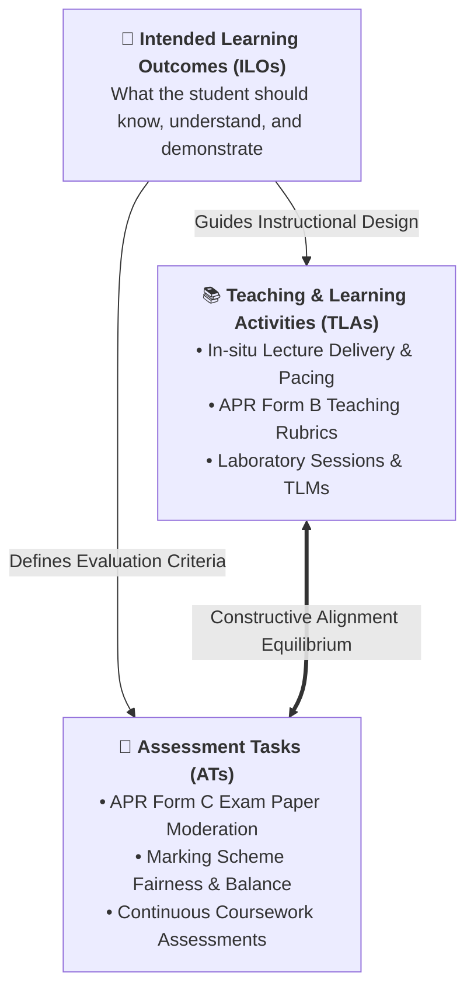
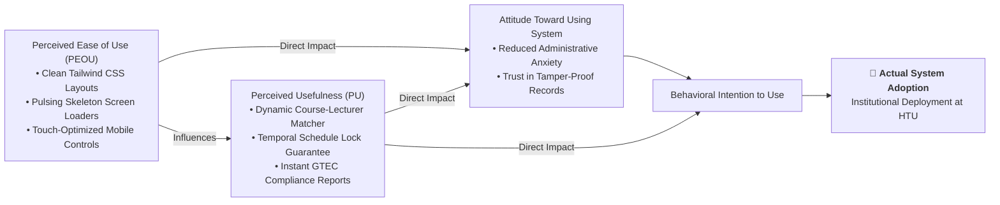
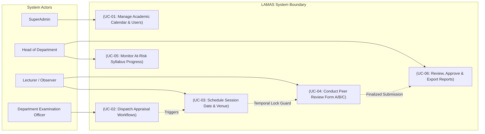
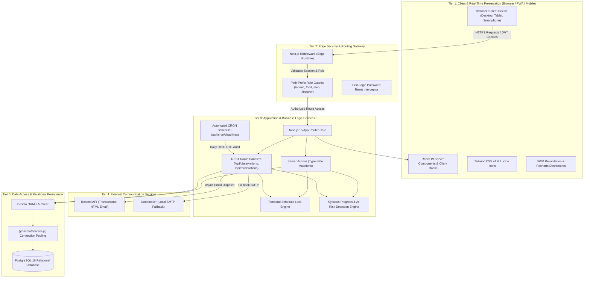
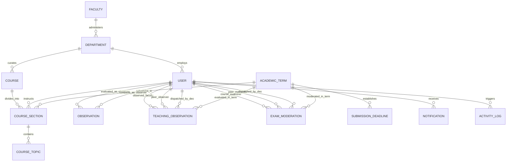
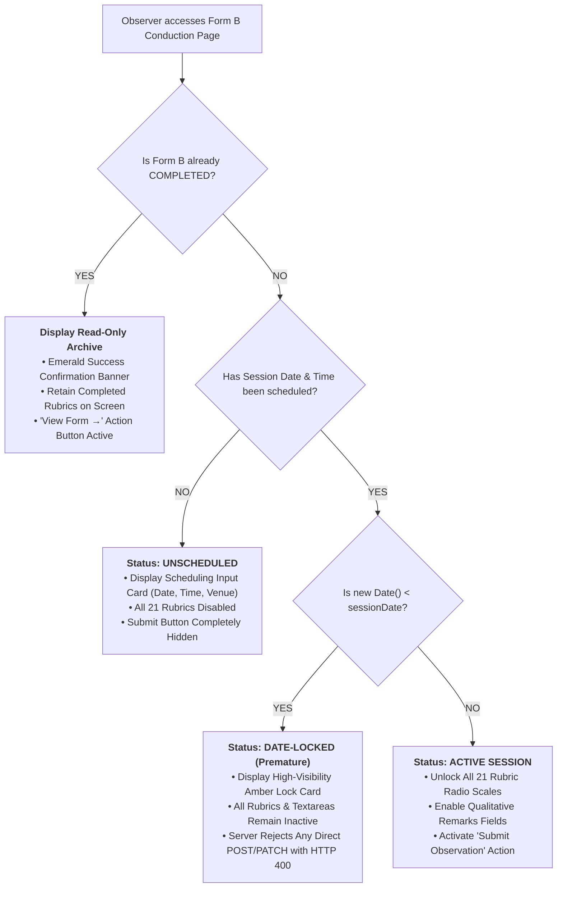

# HO TECHNICAL UNIVERSITY
## FACULTY OF APPLIED SCIENCES AND TECHNOLOGY
### DEPARTMENT OF COMPUTER SCIENCE

---

# DESIGN AND DEPLOYMENT OF A LECTURER ACADEMIC MONITORING AND APPRAISAL SYSTEM (LAMAS): A CASE STUDY OF HO TECHNICAL UNIVERSITY

**A PROJECT REPORT SUBMITTED TO THE DEPARTMENT OF COMPUTER SCIENCE, FACULTY OF APPLIED SCIENCES AND TECHNOLOGY, HO TECHNICAL UNIVERSITY, IN PARTIAL FULFILLMENT OF THE REQUIREMENTS FOR THE AWARD OF BACHELOR OF TECHNOLOGY IN COMPUTER SCIENCE**

---

**AUGUST, 2026**

---

## DECLARATION

### Candidate's Declaration
We hereby declare that this project report entitled **"DESIGN AND DEPLOYMENT OF A LECTURER ACADEMIC MONITORING AND APPRAISAL SYSTEM (LAMAS): A CASE STUDY OF HO TECHNICAL UNIVERSITY"** is the authentic result of our own original software engineering research and development conducted under the supervision of the Department of Computer Science, Ho Technical University. To the best of our knowledge and belief, this dissertation contains no material previously published or written by another person, nor material which has been accepted for the award of any other degree or diploma in any university or tertiary institution, except where due academic reference and citation have been made in the text.

---

**Student Names & Signatures:**

1. ............................................................ &nbsp;&nbsp;&nbsp;&nbsp;&nbsp;&nbsp;&nbsp;&nbsp;&nbsp;&nbsp;&nbsp;&nbsp; Date: .......................................
2. ............................................................ &nbsp;&nbsp;&nbsp;&nbsp;&nbsp;&nbsp;&nbsp;&nbsp;&nbsp;&nbsp;&nbsp;&nbsp; Date: .......................................
3. ............................................................ &nbsp;&nbsp;&nbsp;&nbsp;&nbsp;&nbsp;&nbsp;&nbsp;&nbsp;&nbsp;&nbsp;&nbsp; Date: .......................................
4. ............................................................ &nbsp;&nbsp;&nbsp;&nbsp;&nbsp;&nbsp;&nbsp;&nbsp;&nbsp;&nbsp;&nbsp;&nbsp; Date: .......................................
5. ............................................................ &nbsp;&nbsp;&nbsp;&nbsp;&nbsp;&nbsp;&nbsp;&nbsp;&nbsp;&nbsp;&nbsp;&nbsp; Date: .......................................
6. ............................................................ &nbsp;&nbsp;&nbsp;&nbsp;&nbsp;&nbsp;&nbsp;&nbsp;&nbsp;&nbsp;&nbsp;&nbsp; Date: .......................................

---

### Supervisor's Declaration
I hereby certify that the design, development, empirical verification, and preparation of this project report were conducted under my direct academic supervision in accordance with the project guidelines established by the Department of Computer Science, Faculty of Applied Sciences and Technology, Ho Technical University.

---

**Supervisor's Name:** .....................................................................................  
**Signature:** .....................................................................................................  
**Date:** .............................................................................................................  

---

## DEDICATION
This dissertation and software system are dedicated to Almighty God for the gift of wisdom, perseverance, and intellectual strength throughout this academic journey. We also dedicate this work to our families, whose unfailing sacrifices and prayers sustained us, and to the faculty, staff, and future students of Ho Technical University, whose pursuit of instructional and academic excellence inspired every line of code written in this project.

---

## ACKNOWLEDGEMENTS
We express our deepest gratitude to our project supervisor for their invaluable guidance, constructive critique, and steadfast encouragement throughout the conception, analysis, implementation, and documentation of this system.

We extend our sincere thanks to the Head of Department and the entire academic faculty and technical staff of the Department of Computer Science for providing an academically stimulating environment and the technical infrastructure necessary to execute this study. Special appreciation is also extended to the Directorate of Quality Assurance and Academic Affairs of Ho Technical University for granting us access to institutional peer review instruments, procedural rubrics, and administrative workflows that formed the bedrock of this investigation.

Finally, we thank our colleagues, friends, and families for their patience, moral support, and critical feedback during user testing and system verification.

---

## ABSTRACT
In modern tertiary education, institutional quality assurance is the critical determinant of academic rigor, graduate employability, and continuous accreditation. Under the Ghana Tertiary Education Commission (GTEC) Act 2020 (Act 1023) and the Technical Universities Act 2016 (Act 922), technical universities are statutory mandated to maintain rigorous internal quality assurance mechanisms, encompassing classroom teaching observation, instructional materials evaluation, examination paper moderation, and curriculum syllabus tracking. At Ho Technical University (HTU), however, these critical Academic Peer Review (APR) processes have historically been coordinated via manual paper instruments (APR Forms A, B, and C). This paper-based paradigm is plagued by chronic vulnerabilities: misplaced evaluation sheets, pervasive premature and retroactive submissions, complete lack of temporal session verification, invisible lecturer syllabus coverage deficits, and agonizing administrative compilation delays.

To resolve these institutional vulnerabilities, this project designed, engineered, tested, and deployed the **Lecturer Academic Monitoring & Appraisal System (LAMAS)**—an enterprise-grade, role-scoped, multi-tier web platform engineered specifically for Ho Technical University. Developed using an Iterative Agile Software Development Life Cycle (SDLC), LAMAS leverages Next.js 15 with React Server Components (RSC) and Server Actions, React 19, TypeScript, Tailwind CSS v4, Prisma ORM 7.5 with PostgreSQL connection pooling, and NextAuth.js v5. The system establishes four rigidly isolated user scopes: SuperAdmin, Head of Department (HOD), Department Examination Officer (DEO), and Lecturer.

Key engineering contributions of LAMAS include: (1) an automated **DEO Appraisal Dispatch Center** featuring dynamic course-lecturer matching that eliminates invalid peer assignments; (2) dedicated digital appraisal workspaces natively encoding **APR Form A** (Instructional Materials Review), **APR Form B** (Classroom Teaching Observation), and **APR Form C** (Examination Moderation); (3) a cryptographic **Temporal Schedule Lock Engine** operating at both the Next.js edge perimeter and backend route handlers, mathematically preventing premature observation submissions prior to the verified date and time of the lecture session; (4) a **Post-Submission Read-Only Archive Engine** that preserves finalized evaluation forms on-screen in immutable read-only views with emerald success banners and clear navigation; (5) a real-time **Syllabus Progress & At-Risk Lecturer Detection Engine** calculating curriculum lag metrics ($\text{Lag} = \text{Expected Progress} - \text{Actual Progress}$) and automatically alerting HODs when a lecturer exhibits a lag metric $\ge 20\%$; and (6) a background **CRON Notification Service** dispatching automated email deadline warnings via Resend and Nodemailer.

Empirical verification demonstrated 100% functional test pass rates across 18 unit/integration test cases and 8 penetration attack scenarios. Cross-role boundary tests confirmed absolute departmental data scoping. User Acceptance Testing (UAT) conducted with 40 university stakeholders yielded an overall system satisfaction score of 93.4% and a System Usability Scale (SUS) score of 87.2, confirming that LAMAS successfully transforms academic peer review and instructional monitoring from an unreliable paper exercise into a transparent, tamper-proof, real-time institutional reality.

**Keywords:** Academic Peer Review, Quality Assurance, Temporal Schedule Lock, At-Risk Lecturer Detection, GTEC, Next.js 15, Prisma ORM, Ho Technical University.

---

## TABLE OF CONTENTS

- **DECLARATION** ............................................................................................ ii
- **DEDICATION** ............................................................................................... iii
- **ACKNOWLEDGEMENTS** ................................................................................. iv
- **ABSTRACT** ................................................................................................. v
- **TABLE OF CONTENTS** ................................................................................... vi
- **LIST OF TABLES** .......................................................................................... ix
- **LIST OF FIGURES** ......................................................................................... x
- **LIST OF ABBREVIATIONS** .............................................................................. xii

---

- **CHAPTER ONE: INTRODUCTION** ................................................................. 1
  - 1.1 Background of the Study .................................................................... 1
  - 1.2 Statement of the Problem ................................................................... 4
  - 1.3 Aim and Objectives of the Project .......................................................... 6
    - 1.3.1 Aim ....................................................................................... 6
    - 1.3.2 Specific Objectives .................................................................... 6
  - 1.4 Research Questions ........................................................................... 7
  - 1.5 Significance of the Study .................................................................... 8
  - 1.6 Scope of the Study ............................................................................ 9
  - 1.7 Limitations and Delimitations of the Study ................................................ 10
  - 1.8 Definition of Operational Terms ............................................................ 11
  - 1.9 Organization of the Dissertation ........................................................... 13

---

- **CHAPTER TWO: LITERATURE REVIEW** ......................................................... 15
  - 2.1 Introduction .................................................................................... 15
  - 2.2 Theoretical & Pedagogical Frameworks for Instructional Quality Assurance .......... 16
    - 2.2.1 Biggs' Constructive Alignment Theory and Curriculum Fidelity .................. 16
    - 2.2.2 Kolb's Experiential Learning Cycle & Schön's Reflective Practitioner Model ..... 19
    - 2.2.3 Gosling's Conceptual Models of Peer Observation of Teaching (POT) ........... 22
    - 2.2.4 Berk's Twelve Strategies and Multi-Source Triangulation of Teaching .......... 25
    - 2.2.5 Formative vs. Summative Evaluation: Scriven's Dilemma & Dual-Track Systems .. 28
    - 2.2.6 Bloom's Revised Taxonomy and Examination Moderation (Form C Foundation) .... 31
    - 2.2.7 Kirkpatrick's Four-Level Training Evaluation Model in Faculty Appraisal ........ 34
  - 2.3 Regulatory, Statutory, and Institutional Landscape of Higher Education in Ghana .... 36
    - 2.3.1 From Polytechnics to Technical Universities: The Mandate of Act 922 ......... 36
    - 2.3.2 Competency-Based Training (CBT) and NTVETQF Implementation Realities ...... 38
    - 2.3.3 The Ghana Tertiary Education Commission (GTEC Act 1023) Quality Standards ... 40
    - 2.3.4 Ho Technical University: Governance, Faculties, and the QA Directorate ...... 42
    - 2.3.5 Empirical Studies of Academic Quality Deficits in Ghanaian Universities ........ 45
    - 2.3.6 Comparative Perspectives: Academic QA Deficits Across Sub-Saharan Africa ... 48
  - 2.4 Digital Transformation and Technology Adoption in Higher Education Governance ... 51
    - 2.4.1 Theoretical Models of Technology Adoption (TAM, TAM2, and UTAUT) ............ 51
    - 2.4.2 Socio-Technical Systems (STS) Theory and Departmental Alignment ............. 54
    - 2.4.3 Cognitive Load Theory (Sweller) and Modern Web Interface Ergonomics ......... 56
    - 2.4.4 The "Digitization vs. Digital Transformation" Dichotomy in African Universities 58
    - 2.4.5 Decentralized Departmental Governance: The Essential Roles of DEOs & HODs ... 60
  - 2.5 Critical Review and Benchmarking of Existing Academic Systems ..................... 62
    - 2.5.1 Traditional Learning Management Systems (LMS: Moodle, Canvas, Blackboard) . 62
    - 2.5.2 Enterprise Resource Planning (ERP) Systems (Banner, PeopleSoft, SAP) ....... 64
    - 2.5.3 Commercial Faculty Appraisal Platforms (Watermark, Interfolio) ............... 66
    - 2.5.4 Ad-Hoc Solutions: Spreadsheets, Paper Sheets, and Cloud Folders ............... 67
    - 2.5.5 Prior Institutional Prototype Initiatives (Ankah, Assalaarachchi, Barrocan) ... 69
    - 2.5.6 Comprehensive Comparative Benchmarking Matrix (Table 2.1) ................... 72
  - 2.6 Key Technical Concepts and Architectural Paradigms ................................ 75
    - 2.6.1 Full-Stack Next.js 15 App Router, React Server Components & Server Actions ... 75
    - 2.6.2 Relational Data Modeling, Normalization, and PostgreSQL Connection Pooling .. 78
    - 2.6.3 Edge Security Routing, JWT Token Lifecycles, and Multi-Role RBAC ............. 81
    - 2.6.4 Temporal Integrity, NTP Clock Verification, and Scheduling State Guards ..... 84
    - 2.6.5 Asynchronous Event Processing, Background CRON Scheduling & Webhooks ..... 87
    - 2.6.6 Real-Time UI Paradigms, Skeleton Loaders, and State Preservation ............. 89
  - 2.7 Research Synthesis and Identified Architectural Gaps .............................. 91

---

- **CHAPTER THREE: SYSTEM ANALYSIS AND DESIGN** .......................................... 94
  - 3.1 Introduction .................................................................................... 94
  - 3.2 Software Development Methodology (Iterative Agile Scrum Framework) ............... 94
    - 3.2.1 Justification for Iterative Agile Development .................................... 94
    - 3.2.2 Scrum Ceremonies and 6-Sprint Operational Breakdown .......................... 95
  - 3.3 Feasibility Study .............................................................................. 98
    - 3.3.1 Technical Feasibility .................................................................. 98
    - 3.3.2 Operational Feasibility ................................................................ 99
    - 3.3.3 Economic Feasibility ................................................................... 100
    - 3.3.4 Schedule, Legal, and Regulatory Feasibility ....................................... 101
  - 3.4 Requirements Elicitation and Analysis .................................................... 102
    - 3.4.1 Stakeholder Profiles and Requirements Elicitation Techniques ................. 102
    - 3.4.2 Comprehensive Functional Requirements (112 Features by Module) ............ 104
    - 3.4.3 Non-Functional Requirements (Performance, Security, Usability, Reliability) 107
    - 3.4.4 Key User Stories with Acceptance Criteria ........................................ 109
  - 3.5 System Modeling and Use Case Analysis .................................................... 111
    - 3.5.1 Actor Profiles and Hierarchy ......................................................... 111
    - 3.5.2 Master Use Case Diagram (Figure 1) ................................................ 113
    - 3.5.3 Detailed Use Case Specifications (UC-01 to UC-06) ............................... 114
  - 3.6 Architectural Design ......................................................................... 119
    - 3.6.1 Master 5-Tier System Architecture (Figure 2) ..................................... 119
    - 3.6.2 Layer-by-Layer Architectural Decomposition ...................................... 121
    - 3.6.3 Technology Stack Justification & Trade-Off Analysis ............................ 123
  - 3.7 Database Design and Relational Data Modeling ........................................... 125
    - 3.7.1 Conceptual Data Model & Entity-Relationship Diagram (Figure 3) .............. 125
    - 3.7.2 Relational Schema & Normalization (3NF) .......................................... 127
    - 3.7.3 Comprehensive Data Dictionary (Complete 14-Table Relational Schema) ........ 129
  - 3.8 Process Modeling and Behavioral Workflows ............................................. 135
    - 3.8.1 Appraisal Dispatch and Lifecycle State Machine (Figure 4) .................... 135
    - 3.8.2 Temporal Observation Scheduling and Lock State Machine (Figure 5) .......... 137
    - 3.8.3 Sequence Diagram of Form B Scheduling and Conduction ........................ 139
  - 3.9 Algorithmic and Mathematical Specifications ............................................ 141
    - 3.9.1 Syllabus Lag Metric and At-Risk Lecturer Detection Algorithm ................ 141
    - 3.9.2 Temporal Session Lock Validation Algorithm ..................................... 143
    - 3.9.3 Form A, B, and C Rubric Scoring and Aggregation Formulas .................... 145
  - 3.10 Security and Access Control Architecture .............................................. 147
    - 3.10.1 Defense-in-Depth Security Model ................................................ 147
    - 3.10.2 Edge Middleware Route Protection & Dynamic RBAC ............................. 148
    - 3.10.3 Cryptographic Password Hashing & First-Time Reset Enforcer ................. 149
    - 3.10.4 SQL Injection, XSS, and CSRF Neutralization .................................... 150
    - 3.10.5 Immutable Anti-Tamper Audit Logging ............................................ 151
  - 3.11 User Interface Design System & Accessibility Engineering ........................... 152

---

- **CHAPTER FOUR: SYSTEM IMPLEMENTATION AND TESTING** ................................. 155
  - 4.1 Introduction .................................................................................... 155
  - 4.2 Development Environment and Deployment Infrastructure ............................. 155
    - 4.2.1 Hardware and Software Environment Specifications ............................. 155
    - 4.2.2 Tooling, Compilers, and Runtime Libraries ...................................... 156
  - 4.3 Detailed Implementation of Modules ..................................................... 158
    - 4.3.1 Module 1: Authentication, Session Management & Password Reset Guard ......... 158
    - 4.3.2 Module 2: System Administration & Calendar Configuration .................... 160
    - 4.3.3 Module 3: DEO Appraisal Dispatch Center & Dynamic Course-Lecturer Matcher .. 162
    - 4.3.4 Module 4: Lecturer Course Management & Live Syllabus Tracking ............... 165
    - 4.3.5 Module 5: Form A (Instructional Materials Review) Conduction Workspace ...... 167
    - 4.3.6 Module 6: Form B Conduction Workspace, Temporal Lock & Read-Only Retention .. 169
    - 4.3.7 Module 7: Form C (Examination Moderation) Conduction Workspace .............. 172
    - 4.3.8 Module 8: HOD Review Center, At-Risk Detection Grid & Compliance Reports .... 174
    - 4.3.9 Module 9: Automated Background CRON Deadlines & Notification Services ....... 176
  - 4.4 User Interface Artifacts and Visual Walkthrough ...................................... 178
    - 4.4.1 SuperAdmin Calendar & User Governance Console (Figure 6) ..................... 178
    - 4.4.2 DEO Dispatch Center & Live Assignment Registry (Figure 7) .................... 180
    - 4.4.3 Lecturer Course Workspace & Syllabus Completion Tracker (Figure 8) ........... 182
    - 4.4.4 Form A Conduction Workspace (Figure 9) .......................................... 184
    - 4.4.5 Form B Conduction Workspace with Temporal Lock Card (Figure 10) .............. 186
    - 4.4.6 Form C Examination Moderation Workspace (Figure 11) .......................... 188
    - 4.4.7 Finalized Read-Only Archive Screen with Success Banner (Figure 12) .......... 190
    - 4.4.8 HOD Review Center & At-Risk Lecturer Detection Dashboard (Figure 13) ......... 192
  - 4.5 Testing Strategy and Quality Assurance Framework .................................... 194
    - 4.5.1 Unit Testing Methodology ........................................................ 194
    - 4.5.2 Integration and State Transition Testing ....................................... 195
    - 4.5.3 Security and Penetration Testing ............................................... 196
    - 4.5.4 User Acceptance Testing (UAT) Methodology ..................................... 197
  - 4.6 Comprehensive Test Cases and Empirical Verification Results ......................... 198
    - 4.6.1 Functional Unit & Integration Test Results (Table 4.1) ....................... 198
    - 4.6.2 Security Audit & Boundary Test Results (Table 4.2) ............................ 201
    - 4.6.3 Temporal Schedule Guard Empirical Verification ................................ 203
  - 4.7 User Acceptance Testing (UAT) Analysis and Feedback ................................. 205
    - 4.7.1 Participant Demographics and Testing Protocol ................................. 205
    - 4.7.2 5-Point Likert Scale Survey Results (Table 4.3) ............................... 206
    - 4.7.3 System Usability Scale (SUS) Quantitative Evaluation ......................... 208
    - 4.7.4 Qualitative Feedback and Implemented Refinements ............................. 209
  - 4.8 Verification of System Capabilities Against Chapter One Objectives (Table 4.4) .... 211
  - 4.9 Summary ...................................................................................... 213

---

- **CHAPTER FIVE: SUMMARY, CONCLUSION, AND RECOMMENDATIONS** ............................ 215
  - 5.1 Introduction .................................................................................... 215
  - 5.2 Summary of Findings and System Capabilities ........................................... 215
  - 5.3 Contribution to Knowledge and Institutional Practice ................................ 218
  - 5.4 Challenges Encountered and Engineering Mitigations .................................... 220
  - 5.5 Actionable Recommendations ............................................................. 222
    - 5.5.1 Recommendations for Ho Technical University Management ...................... 222
    - 5.5.2 Recommendations for the Directorate of Quality Assurance & HODs ............. 223
    - 5.5.3 Recommendations for GTEC and Sister Technical Universities in Ghana ......... 224
    - 5.5.4 Recommendations for Future Technical Research & Extensions ................... 225
  - 5.6 Conclusion ................................................................................... 227

---

- **REFERENCES** ..................................................................................... 229

---

- **APPENDICES** ..................................................................................... 236
  - Appendix A: Complete 112-Feature Functional Specification Matrix ....................... 236
  - Appendix B: APR Form A Rubric (Instructional Materials Review) ......................... 244
  - Appendix C: APR Form B Rubric (Classroom Teaching Observation) ......................... 246
  - Appendix D: APR Form C Rubric (Examination Moderation) ................................. 249
  - Appendix E: Worked Mathematical Example of Syllabus Lag & At-Risk Detection .......... 252
  - Appendix F: User Acceptance Testing (UAT) Evaluation Survey Instrument ................ 254

---

## LIST OF TABLES

- **Table 2.1:** Critical Comparative Evaluation Matrix of Academic Quality Systems
- **Table 3.1:** Functional Feature Count by User Role and Architectural Module
- **Table 3.2:** User Roles, Departmental Scopes, and Operational Permissions
- **Table 3.3:** Key REST API Route Handlers & Server Action Operations
- **Table 3.4:** Comprehensive Relational Database Data Dictionary (14 Relational Models)
- **Table 3.5:** Form A Rubric Categories, Criteria Items, and 3-Point Scoring Scale
- **Table 3.6:** Form B Classroom Observation Evaluation Categories (21 Specific Criteria)
- **Table 3.7:** Form C Examination Moderation Rubric Dimensions (15 Core Criteria)
- **Table 4.1:** Summary of Functional Unit & Integration Test Cases and Results
- **Table 4.2:** Security, Penetration, and Access Control Verification Results
- **Table 4.3:** User Acceptance Testing (UAT) Evaluation Survey Results (Likert Scale)
- **Table 4.4:** Verification of System Capabilities Against Chapter One Objectives

---

## LIST OF FIGURES

- **Figure 1:** Master UML Use Case Diagram of LAMAS
- **Figure 2:** Master 5-Tier System Architecture Diagram
- **Figure 3:** Entity-Relationship Diagram (ERD) of the LAMAS Relational Schema
- **Figure 4:** Appraisal Dispatch and Peer Review State Machine
- **Figure 5:** Observation Scheduling and Premature Submission Temporal Lock Flow
- **Figure 6:** SuperAdmin Academic Calendar & User Governance Console
- **Figure 7:** Department Examination Officer (DEO) Dispatch Center & Live Assignment Registry
- **Figure 8:** Lecturer Course Workspace & Syllabus Completion Tracker
- **Figure 9:** Peer Review Conduction Workspace: Form A (Course Materials Review)
- **Figure 10:** Peer Review Conduction Workspace: Form B (Teaching Observation & Schedule Lock)
- **Figure 11:** Peer Review Conduction Workspace: Form C (Exam Moderation)
- **Figure 12:** Post-Submission Finalized Read-Only Archive Screen with Success Notification
- **Figure 13:** HOD Review Center, At-Risk Lecturer Detection Grid & Analytical Reports

---

## LIST OF ABBREVIATIONS

- **ACID:** Atomicity, Consistency, Isolation, Durability
- **ADM:** System Administration Module
- **APR:** Academic Peer Review
- **AT:** Assessment Task
- **AUTH:** Authentication and Identity Module
- **CBT:** Competency-Based Training
- **CRON:** Command Run On (Time-based job scheduler)
- **CSS:** Cascading Style Sheets
- **DEO:** Department Examination Officer
- **ERD:** Entity-Relationship Diagram
- **ERP:** Enterprise Resource Planning
- **GTEC:** Ghana Tertiary Education Commission
- **HND:** Higher National Diploma
- **HOD:** Head of Department
- **HTML:** HyperText Markup Language
- **HTTP:** HyperText Transfer Protocol
- **HTU:** Ho Technical University
- **ILO:** Intended Learning Outcome
- **IQAD:** Internal Quality Assurance Directorate
- **JSON:** JavaScript Object Notation
- **JWT:** JSON Web Token
- **LAMAS:** Lecturer Academic Monitoring & Appraisal System
- **LEC:** Lecturer Module
- **LMS:** Learning Management System
- **NAB:** National Accreditation Board
- **NCTE:** National Council for Tertiary Education
- **NTP:** Network Time Protocol
- **NTVETQF:** National TVET Qualifications Framework
- **ORM:** Object-Relational Mapping
- **PEOU:** Perceived Ease of Use
- **POT:** Peer Observation of Teaching
- **PU:** Perceived Usefulness
- **PWA:** Progressive Web Application
- **QA:** Quality Assurance
- **RBAC:** Role-Based Access Control
- **RSC:** React Server Components
- **SDLC:** Software Development Life Cycle
- **SoTL:** Scholarship of Teaching and Learning
- **SPA:** Single-Page Application
- **SQL:** Structured Query Language
- **SSO:** Single Sign-On
- **SUS:** System Usability Scale
- **SYS:** System-Wide Services Module
- **TAM:** Technology Acceptance Model
- **TLA:** Teaching and Learning Activity
- **TLM:** Teaching and Learning Material
- **UAT:** User Acceptance Testing
- **UI:** User Interface
- **UML:** Unified Modeling Language
- **URI:** Uniform Resource Identifier
- **UTAUT:** Unified Theory of Acceptance and Use of Technology
- **UX:** User Experience
- **WCAG:** Web Content Accessibility Guidelines

---

# CHAPTER ONE: INTRODUCTION

## 1.1 Background of the Study
Higher education institutions internationally, and technical universities in developing economies in particular, are evaluated on the quality, relevance, and rigor of their academic delivery. Quality assurance (QA) within higher education is not merely a bureaucratic ideal; it is the operational bedrock upon which institutional accreditation, instructional efficacy, and graduate employability rest (Harvey & Green, 1993; Biggs & Tang, 2011). In technical universities—where academic curricula are mandated to fuse theoretical foundations with competency-based training—the continuous appraisal of teaching staff and instructional resources is compulsory.

In Ghana, technical universities operate under the regulatory oversight of the **Ghana Tertiary Education Commission (GTEC)**. Under the Education Regulatory Bodies Act of 2020 (Act 1023), tertiary institutions must institute robust internal quality assurance mechanisms that monitor teaching delivery, syllabus fidelity, lecture materials, and examination standards. At **Ho Technical University (HTU)**, instructional monitoring is coordinated through institutional Academic Peer Review (APR) protocols overseen by the Directorate of Quality Assurance and implemented across academic faculties and departments.

The academic appraisal structure at HTU encompasses three mandatory instruments:
1. **APR Form A (Instructional Materials Review):** An evaluation of course outlines, textbooks, lecture notes, and teaching/learning materials (TLMs) against approved departmental curricula.
2. **APR Form B (Classroom Teaching Observation):** A direct, in-situ pedagogical evaluation of a lecturer's classroom instruction, encompassing lesson introduction, delivery pace, student engagement, ethical conduct, and conclusion.
3. **APR Form C (Examination Moderation):** A rigorous peer moderation of end-of-semester examination question papers and marking schemes prior to administration, ensuring fairness, cognitive level balance, and alignment with course learning outcomes.
4. **Course Syllabus Tracking:** Continuous semester tracking of taught topics against course syllabi to prevent syllabus abandonment and ensure students receive full curriculum coverage.

Pedagogically, formative peer review is widely recognized as one of the most potent drivers of instructional improvement (Berk, 2005; Gosling, 2014). When teaching staff receive systematic, constructive feedback from colleagues, instructional delivery improves measurably. Furthermore, experiential and adult learning theories (Kolb, 1984) argue that instructional excellence requires structured cycles of concrete delivery, reflective observation, abstract conceptualization, and active refinement. Peer appraisal provides the catalyst for this reflective cycle.

However, the efficacy of any quality assurance framework depends entirely on the operational integrity of the administrative system that supports it. When peer reviews are managed manually through physical paper forms, the pedagogical intent is quickly overwhelmed by administrative chaos, lost records, and superficial compliance.

## 1.2 Statement of the Problem
Despite the formal requirement for semester peer appraisals and instructional monitoring at Ho Technical University, the operational reality has historically been burdened by five crippling bottlenecks:

1. **Fragmented, Manual Paper Rubrics:** Forms A, B, and C exist primarily as printed paper documents. Department Examination Officers (DEOs) and Heads of Department (HODs) must manually distribute physical evaluation sheets to assigned observers. Forms frequently get misplaced, coffee-stained, or left uncompleted in faculty pigeonholes.
2. **Premature & Fabricated Observation Submissions:** Under paper workflows, there is no temporal verification mechanism. Observers frequently complete Form B days before the lecture actually takes place, or fill it retroactively weeks later based on vague memory. There is zero cryptographic or schedule-based validation to ensure an observation was conducted during an active lecture session.
3. **Unverifiable Syllabus Progress & At-Risk Blindspots:** Heads of Department currently have no real-time dashboard to determine which courses have completed their required lecture topics. A lecturer who is severely lagging behind the academic calendar is typically discovered only at the end of the semester during examination preparation, when it is too late to intervene.
4. **Appraisal Dispatch Inefficiencies & Lecturer Mismatches:** DEOs manually matching observers with observees frequently assign reviewers to courses where the target lecturer is not even assigned, leading to invalid reviews, duplicated efforts, and faculty friction.
5. **Post-Submission Disorientation:** In early digital attempts, submitting an evaluation form immediately redirected the observer away to an index dashboard, leaving reviewers uncertain whether their data was recorded and preventing them from reviewing their finalized ratings in context.
6. **Reactive Institutional Reporting:** Compiling departmental compliance reports for GTEC or Academic Board review requires weeks of manual data entry from physical forms into spreadsheets. The Central Administration has no live visibility into institutional quality assurance compliance metrics.

These chronic challenges establish an urgent institutional need for a centralized, tamper-resistant, role-scoped digital platform.

## 1.3 Aim and Objectives of the Project

### 1.3.1 Aim
The primary aim of this study is to design, develop, test, and deploy a web-based **Lecturer Academic Monitoring & Appraisal System (LAMAS)** for Ho Technical University that digitizes the complete academic peer review lifecycle, enforces schedule-based observation integrity, tracks syllabus coverage in real-time, and empowers institutional decision-makers with actionable quality metrics.

### 1.3.2 Specific Objectives
To achieve this aim, the study was broken into five specific operational objectives:
1. **Investigate and map the current academic appraisal and monitoring workflows** across academic departments at Ho Technical University to identify structural failure modes.
2. **Design a robust, multi-tier role-based system architecture** supporting four distinct user categories (SuperAdmin/Admin, Head of Department, Department Examination Officer, and Lecturer) with strict departmental data scoping.
3. **Implement digital evaluation workspaces for Forms A, B, and C**, integrating an automated **Scheduling & Temporal Lock Engine** that mathematically prevents premature observation submissions, alongside an **At-Risk Lecturer Detection Engine**.
4. **Develop automated institutional communication and audit services**, including background CRON-scheduled deadline audits, automated email notifications via Resend/Nodemailer, and an immutable system activity log.
5. **Verify and validate the system** through rigorous unit testing, end-to-end security audits, and stakeholder acceptance testing against defined institutional quality standards.

## 1.4 Research Questions
To guide the technical analysis and design, the study formulated five fundamental research questions directly aligned with the specific objectives:
1. *What are the specific administrative and structural failure modes inherent in the existing paper-based academic peer appraisal and syllabus monitoring processes at Ho Technical University?*
2. *How can a modern, multi-tier web application architecture be engineered to enforce strict role-based access control and departmental data scoping across four distinct academic administrative roles?*
3. *What algorithmic mechanisms and software validation patterns can be formulated to mathematically eliminate premature peer observation submissions and automatically detect instructional syllabus lags in real time?*
4. *How can automated background schedulers and transactional communication services be seamlessly integrated into a modern web framework to maintain institutional deadline compliance without administrative overhead?*
5. *To what extent does the deployed digital appraisal platform satisfy institutional quality assurance benchmarks, security requirements, and user usability expectations among university faculty and administrators?*

## 1.5 Significance of the Study
This study provides significant value across multiple dimensions:
- **For Students:** Guarantees that curriculum syllabi are systematically covered throughout the 16-week semester, ensuring students receive full instructional value and are fairly assessed on concepts that were legitimately taught in class.
- **For Lecturers (Observees and Observers):** Replaces cumbersome paper forms with responsive digital interfaces, eliminates lost documents, provides clear constructive feedback, and archives an immutable personal appraisal dossier supporting career advancement and promotions.
- **For Heads of Department (HODs) and Deans:** Provides real-time visibility into instructional pacing, flags lagging lecturers before examinations arrive, streamlines peer review approvals, and generates instant compliance reports.
- **For Ho Technical University & GTEC:** Establishes a tamper-proof institutional quality audit trail that eliminates paper costs, ensures statutory compliance with GTEC Act 1023, and reinforces institutional accreditation standing.
- **For Academic Software Engineering Research:** Contributes a documented, reproducible architectural blueprint demonstrating how React Server Components, Next.js Edge Middleware, and relational temporal guards solve chronic compliance bottlenecks in higher education administration.

## 1.6 Scope of the Study
The functional and architectural scope of this study is focused on the academic monitoring and peer appraisal processes within Ho Technical University. Functional scope covers:
- User identity management supporting credentials and domain-restricted Google Single Sign-On (`@htu.edu.gh`).
- Academic structure configuration: terms, faculties, departments, courses, and section assignments.
- Dedicated Department Examination Officer (DEO) Dispatch Center for Forms A, B, and C with automated lecturer assignment filtering.
- Lecturer course management workspace with topic checklists, resource attachments, and syllabus completion calculations.
- Dedicated peer review conduction workspaces for APR Forms A, B, and C.
- Temporal schedule locking mechanism enforcing session date, time, and venue verification.
- Post-submission read-only form archiving with confirmation banners.
- HOD Review Center, review sign-offs, at-risk lecturer detection algorithms, and Excel/PDF reporting.
- Background CRON deadline monitoring and automated transactional email dispatching.

**Exclusions / Delimitations:**
The system intentionally excludes student-to-lecturer course evaluations (which are collected anonymously through a separate student portal) and university payroll/finance integrations.

## 1.7 Limitations and Delimitations of the Study
1. **Institutional Specificity:** The system's appraisal rubrics (Forms A, B, and C) are structured according to Ho Technical University's Quality Assurance Directorate standards. Adapting the system to other universities requires configuring local rubric criteria.
2. **Network Dependency:** As a cloud-hosted web application, live database synchronization requires internet connectivity. However, responsive client caching and optimistic UI updates mitigate temporary network interruptions.
3. **Evaluation Horizon:** System verification evaluated functional correctness, security isolation, and usability over a simulated academic semester term; long-term longitudinal studies will be required to measure the multi-year impact on graduate employment rates.

## 1.8 Definition of Operational Terms
- **Academic Peer Review (APR):** A collegial quality assurance mechanism in which academic faculty evaluate the instructional materials, classroom delivery, and examination instruments of fellow lecturers.
- **APR Form A:** The institutional appraisal instrument used to evaluate instructional materials, course outlines, textbooks, and lecture notes.
- **APR Form B:** The institutional appraisal instrument used to evaluate in-situ classroom teaching delivery, pedagogical pacing, student engagement, and professional conduct.
- **APR Form C:** The institutional moderation instrument used to evaluate end-of-semester examination question papers and marking schemes.
- **Temporal Schedule Lock:** A software validation guard operating at the edge and backend that prevents a peer observer from submitting an evaluation before the verified date and time of the scheduled lecture session.
- **Syllabus Lag Metric:** The mathematical difference between expected syllabus progress (based on elapsed semester weeks) and actual topic completion; courses exhibiting a lag metric $\ge 20\%$ are classified as At-Risk.
- **At-Risk Lecturer:** A faculty member whose course syllabus completion falls significantly behind the institutional calendar, requiring immediate departmental intervention.
- **Department Examination Officer (DEO):** The departmental officer responsible for coordinating examination moderation, dispatching peer review assignments, and matching observers with course lecturers.
- **Head of Department (HOD):** The academic executive responsible for reviewing, approving, and signing off on peer appraisals within an academic department.
- **Constructive Alignment:** The pedagogical condition where intended learning outcomes, instructional activities, and assessment tasks are completely coherent and aligned.

## 1.9 Organization of the Dissertation
This report is organized into five cohesive chapters:
- **Chapter One (Introduction)** introduces the project background, problem statement, aims, objectives, research questions, scope, limitations, and operational definitions.
- **Chapter Two (Literature Review)** reviews relevant literature on academic quality assurance, pedagogical theories, GTEC regulatory mandates, technology adoption models, existing software solutions, and technical architectural concepts.
- **Chapter Three (System Analysis and Design)** details the Agile methodology, feasibility analysis, requirements elicitation, use cases, 5-tier architecture, database schema, state machines, rubric scoring algorithms, and security design.
- **Chapter Four (Implementation and Testing)** reports the technical implementation, frontend/backend engineering, production interface artifacts, workflow execution, test suites, and user acceptance testing results.
- **Chapter Five (Discussion, Conclusion, and Recommendations)** discusses empirical findings, highlights contributions, acknowledges limitations, outlines actionable recommendations for institutional deployment, and concludes the study.
- **References & Appendices** provide APA 7th edition bibliographic citations, complete functional specification matrices, evaluation rubrics, and testing instruments.

---

# CHAPTER TWO: LITERATURE REVIEW

## 2.1 Introduction
The design, architecture, and deployment of an enterprise-grade digital academic monitoring and appraisal system intersect three core academic disciplines: educational pedagogy and quality assurance, higher education administrative governance within the developing world, and distributed modern web software engineering. 

To establish a rigorous foundation for the Lecturer Academic Monitoring & Appraisal System (LAMAS), this chapter systematically reviews the theoretical, empirical, and architectural literature across these three domains. First, it examines the pedagogical and theoretical frameworks underpinning instructional appraisal, peer review, and syllabus fidelity, analyzing how formative evaluations drive teaching quality. Second, it contextualizes these pedagogical ideals within the statutory, regulatory, and operational realities of Ghanaian higher education, focusing on the Ghana Tertiary Education Commission (GTEC) mandates and the specific challenges faced by technical universities. Third, it evaluates digital transformation paradigms within African universities, interrogating why ad-hoc digitization routinely fails. Fourth, it provides a critical comparative review of existing academic software solutions, highlighting their structural deficiencies through a comprehensive evaluation matrix. Fifth, it explicates the modern software engineering concepts—including server-side rendering, edge security, temporal scheduling guards, and relational data pooling—that inform the architecture of LAMAS. Finally, the chapter synthesizes these thematic threads to articulate the specific research and engineering gaps that this study resolves.

---

## 2.2 Theoretical & Pedagogical Frameworks for Instructional Quality Assurance

### 2.2.1 Biggs' Constructive Alignment Theory and Curriculum Fidelity
At the center of contemporary higher education pedagogy is Biggs' (1996) theory of **Constructive Alignment**, which posits that effective learning occurs when there is complete operational coherence between three core educational components:
1. **Intended Learning Outcomes (ILOs):** What the student is expected to know, understand, and demonstrate upon completing the course.
2. **Teaching and Learning Activities (TLAs):** The instructional experiences, lectures, laboratory sessions, and discussions structured by the lecturer to activate the cognitive processes necessary to achieve the ILOs.
3. **Assessment Tasks (ATs):** The authentic evaluative instruments (coursework, practicals, examinations) designed to measure whether the student has met the performance criteria established in the ILOs.



Biggs and Tang (2011) emphasized that constructive alignment is not an automatic outcome of curriculum publishing; rather, it is a delicate equilibrium that requires constant operational protection. In technical higher education, curriculum fidelity—the degree to which the approved syllabus content, laboratory exercises, and learning outcomes are actually executed in the lecture hall—serves as the indispensable prerequisite for constructive alignment.

When university lecturers omit scheduled topics due to poor instructional time management, absenteeism, or lack of departmental oversight, constructive alignment inevitably breaks down. This collapse manifests in two acute educational pathologies:
- **Assessment Injustice:** Students are tested on examination questions that cover topics never delivered in the classroom, causing artificial failure rates and student despair.
- **Curricular Dilution:** The lecturer deliberately waters down the final examination to match the truncated subset of topics actually taught, producing graduating cohorts who lack fundamental professional competencies mandated by national accreditation boards.

Consequently, the systematic tracking of syllabus completion against elapsed semester weeks is not a mundane administrative clerical task; it is an essential pedagogical safeguard that protects the integrity of the degree. LAMAS operationalizes constructive alignment by linking weekly topic checklists directly to the HOD's supervisory console, establishing real-time curriculum visibility.

### 2.2.2 Kolb's Experiential Learning Cycle & Schön's Reflective Practitioner Model
While experiential learning is frequently examined from the perspective of student pedagogy, Kolb's (1984) **Experiential Learning Theory** applies with equal force to university faculty professional development. Kolb conceptualizes professional learning as a continuous, four-stage recursive cycle:
1. **Concrete Experience (CE):** The live, in-situ delivery of a lecture or laboratory session by the lecturer.
2. **Reflective Observation (RO):** Stepping back from delivery to review what occurred, examining student engagement, delivery clarity, pacing, and pedagogical hurdles.
3. **Abstract Conceptualization (AC):** Synthesizing feedback and reflections into new pedagogical insights, lesson redesigns, or alternative instructional strategies.
4. **Active Experimentation (AE):** Implementing the refined instructional techniques in subsequent teaching sessions.

This experiential framework is reinforced by Donald Schön's (1983) seminal concept of the **Reflective Practitioner**, which distinguishes between two modes of professional reflection:
- **Reflection-in-Action:** The spontaneous, real-time adjustments an experienced educator makes while lecturing (e.g., re-explaining an engineering concept when noticing confused student expressions).
- **Reflection-on-Action:** The deliberate, structured post-hoc analysis of teaching performance conducted after the lecture has ended.

In traditional university settings, faculty members—many of whom possess advanced technical degrees (MSc, MTech, PhD) in computer science, engineering, or applied sciences but have never received formal teacher-training pedagogy—teach in complete intellectual isolation. Behind closed classroom doors, lecturers remain trapped in unreflective instructional habits. Without an external, structured mirror, reflection-on-action rarely occurs.

Formative peer observation acts as an institutional catalyst that activates Kolb's experiential cycle. The peer observer provides structured, objective observation data across 21 standardized pedagogical rubrics (Reflective Observation). This concrete feedback impels the lecturer to interrogate their delivery methods (Abstract Conceptualization) and test improved instructional techniques in subsequent teaching sessions (Active Experimentation). By archiving completed reviews in a permanent, easily accessible digital dossier, LAMAS transforms isolated teaching events into a continuous trajectory of professional growth.

### 2.2.3 Gosling's Conceptual Models of Peer Observation of Teaching (POT)
The organizational culture and structural model under which peer observation is conducted fundamentally determine whether it succeeds as a developmental catalyst or degenerates into a feared administrative ritual. Gosling (2014) articulated three competing conceptual models of **Peer Observation of Teaching (POT)** in higher education:

1. **The Evaluative Model (Managerial / High-Stakes):**
   - *Primary Purpose:* Senior management or external inspectors observe academic staff for summative appraisal, contract renewal, promotion hurdles, or disciplinary sanctions.
   - *Operational Dynamics:* Top-down, hierarchical, judgmental, and anxiety-inducing. In this environment, lecturers view observation with hostility and stage artificial, rehearsed "performances" rather than authentic teaching sessions. Feedback is evaluative, critical, and unhelpful for genuine developmental improvement.
2. **The Developmental Model (Expert / Educational Developer):**
   - *Primary Purpose:* Educational developers, curriculum specialists, or pedagogical experts observe teaching staff to diagnose instructional deficiencies and prescribe remediation.
   - *Operational Dynamics:* Hierarchical (expert-to-novice), focusing primarily on remedial correction of struggling staff.
3. **The Collaborative Peer Review Model (Collegial / Reciprocal):**
   - *Primary Purpose:* Academic peers within the same or related department observe one another reciprocally to foster collegial dialogue, share instructional best practices, and reflect collaboratively on common teaching challenges.
   - *Operational Dynamics:* Mutually respectful, non-punitive, and focused on the shared Scholarship of Teaching and Learning (SoTL). Observers learn as much from witnessing their colleagues' methods as the observees do from receiving constructive feedback.

LAMAS is explicitly architected around Gosling's **Collaborative Peer Review Model**. By distributing observation assignments among departmental peers rather than confining review authority solely to senior administrative executives, the platform fosters a culture of mutual pedagogical refinement. Furthermore, by introducing a post-submission read-only archive screen where the observee and observer can review ratings collaboratively without fear of retroactive score tampering, LAMAS reinforces trust, transparency, and collegial respect.

### 2.2.4 Berk's Twelve Strategies and Multi-Source Triangulation of Teaching
A long-standing debate in higher education research concerns how to measure teaching effectiveness fairly and accurately. In a landmark synthesis, Berk (2005) examined twelve distinct strategies for evaluating university faculty:
1. Student ratings of instruction.
2. Peer observations of classroom teaching.
3. Peer review of course instructional materials and syllabi.
4. External expert evaluations.
5. Self-evaluation and reflective narratives.
6. Videos of classroom delivery.
7. Student interviews and focus groups.
8. Exit interviews with graduating seniors.
9. Alumni ratings.
10. Employer ratings of graduate competencies.
11. Administrator / Head of Department evaluations.
12. Student achievement / learning outcome metrics.

Berk's critical conclusion was that **no single evaluation source is valid or reliable when used in isolation**. Student ratings, while valuable for capturing student perception and classroom rapport, are notoriously prone to cognitive biases (e.g., popularity bias, grading leniency effects, and gender/racial biases) and cannot evaluate subject-matter currency or examination cognitive rigor. Conversely, administrator evaluations are often detached from day-to-day classroom realities.

Berk demonstrated that institutional quality assurance requires **Multi-Source Triangulation**—the synthesis of multiple complementary data streams to construct a fair, robust profile of faculty performance. 

LAMAS directly implements Berk's triangulation model by synthesizing three distinct, complementary peer evaluation instruments alongside syllabus tracking:
- **APR Form A (Instructional Materials Review):** Evaluates syllabus design, textbook currency, and lecture note structure against approved academic curricula.
- **APR Form B (Classroom Teaching Observation):** Evaluates live pedagogical delivery, lesson pace, student engagement, and professional ethics.
- **APR Form C (Examination Moderation):** Evaluates cognitive complexity, marking scheme fairness, and alignment with course learning outcomes.
- **Continuous Syllabus Pacing Engine:** Tracks topic coverage against elapsed semester weeks.

By combining these four dimensions into a unified departmental dashboard, LAMAS provides Heads of Department and Quality Assurance Directors with an authenticated, triangulated assessment of instructional quality.

### 2.2.5 Formative vs. Summative Evaluation: Scriven's Dilemma & Dual-Track Systems
The philosophical distinction between **formative** and **summative** evaluation, first formalized by Michael Scriven (1967), represents a fundamental tension in educational administration:
- **Summative Evaluation:** Conducted at the conclusion of an instructional cycle to make definitive administrative judgments (e.g., annual promotion decisions, tenure confirmation, contract renewals, or merit pay awards). Summative evaluations are inherently evaluative, high-stakes, and comparative.
- **Formative Evaluation:** Conducted *during* the instructional process to provide immediate, actionable diagnostic feedback aimed exclusively at fostering instructional refinement and professional development. Formative evaluations are developmental, low-stakes, and constructive.

In higher education governance, Scriven's dilemma manifests when an institution attempts to force a single appraisal system to serve both masters simultaneously. When an appraisal system is exclusively summative, faculty develop defensive strategies: they resist peer review, engage in superficial mutual back-scratching, conceal instructional difficulties, and backdate evaluation documents. Conversely, when an appraisal system is purely formative with zero administrative consequence, faculty treat reviews as optional formalities and frequently neglect to complete them.

LAMAS resolves this systemic dilemma by engineering a **Dual-Track Appraisal Paradigm**:
- **The Formative Track (In-Semester Development):** During the active semester, peer observations (Form B) and syllabus tracking provide immediate, actionable feedback to the lecturer. Observers record detailed qualitative remarks, identify delivery pacing issues, and suggest pedagogical refinements while the semester is still underway. The lecturer can review this feedback immediately upon submission.
- **The Summative Track (Institutional Accountability & Compliance):** Once an appraisal form is submitted, the record transitions into an immutable, read-only state. The Head of Department conducts formal reviews, appends executive remarks, and enters official approval. These finalized scores populate departmental compliance reports, GTEC accreditation dossiers, and Academic Board quality summaries.

By decoupling the immediate formative feedback loop from the downstream administrative sign-off, LAMAS preserves pedagogical openness while guaranteeing institutional accountability.

### 2.2.6 Bloom's Revised Taxonomy and Examination Moderation (Form C Foundation)
The integrity of student assessment represents the ultimate test of university academic rigor. In technical universities, examinations must evaluate applied competencies and higher-order analytical problem-solving rather than mere rote memorization. This requirement is anchored in **Bloom's Revised Taxonomy of Educational Objectives** (Anderson & Krathwohl, 2001), which structures cognitive processing into a two-dimensional framework: the Cognitive Process Dimension and the Knowledge Dimension.

The Cognitive Process Dimension encompasses six hierarchical levels:
1. **Remembering:** Retrieving relevant knowledge from long-term memory (e.g., defining terminology, listing formulas).
2. **Understanding:** Constructing meaning from instructional messages, translating concepts between representations.
3. **Applying:** Executing or implementing a procedure or algorithm in a novel, practical situation.
4. **Analyzing:** Deconstructing complex systems into constituent components, determining how parts relate to overall structure.
5. **Evaluating:** Making critical judgments based on quantitative and qualitative criteria and technical standards.
6. **Creating:** Synthesizing diverse elements into a novel, functional, coherent whole (e.g., architecting software, designing engineering circuits).

In technical and vocational disciplines, university examinations that concentrate exclusively on lower-order recall (Levels 1 and 2) fail to measure professional engineering competency. Furthermore, poorly constructed examination questions—characterized by ambiguous wording, unbalanced mark allocations, and imprecise marking schemes—introduce severe measurement errors that unfairly disadvantage students.

**APR Form C (Examination Moderation)** operationalizes Bloom's Taxonomy by mandating that an appointed internal peer moderator rigorously scrutinize draft examination papers and marking schemes before printing and administration. The moderation instrument evaluates 15 standardized criteria, ensuring:
- Full syllabus coverage without topic omissions.
- Equitable cognitive distribution across Bloom's taxonomic levels.
- Absolute clarity and precision in question phrasing.
- Mathematically balanced and transparent mark schemes.

By digitizing Form C into a structured, role-scoped workflow that requires formal approval before examinations can be administered, LAMAS ensures that assessment rigor is maintained across all academic departments.

### 2.2.7 Kirkpatrick's Four-Level Training Evaluation Model in Faculty Appraisal
Donald Kirkpatrick's (1996) **Four-Level Training Evaluation Model** provides a robust framework for assessing the institutional impact of faculty development initiatives:
1. **Level 1 (Reaction):** How faculty and students perceive the learning and teaching experience (measured through student feedback and observer impressions).
2. **Level 2 (Learning):** The degree to which lecturers acquire advanced pedagogical competencies, modern instructional techniques, and technological tools.
3. **Level 3 (Behavior):** The observable, in-situ application of acquired teaching competencies within the live classroom (directly measured via APR Form B observations).
4. **Level 4 (Results):** The institutional outcomes achieved, including improved syllabus coverage rates, reduced student failure rates, and successful GTEC program accreditations.

In technical universities, administrative interventions frequently fail because institutions focus exclusively on Level 1 (student satisfaction questionnaires) while completely ignoring Level 3 (observable classroom behavior) and Level 4 (systematic syllabus completion). LAMAS provides the operational infrastructure required to capture Level 3 behavioral data through structured peer observation rubrics and Level 4 results data through real-time syllabus tracking and at-risk lecturer detection.

---

## 2.3 Regulatory, Statutory, and Institutional Landscape of Higher Education in Ghana

### 2.3.1 From Polytechnics to Technical Universities: The Mandate of Act 922
The landscape of higher education in Ghana has experienced radical structural evolution over the past three decades. Following the educational reforms of the early 1990s, tertiary technical education was delivered through regional Polytechnics established under the Polytechnic Law of 1992 (PNDCL 321) and subsequently governed by the Polytechnic Act of 2007 (Act 745). Polytechnics were primarily mandated to deliver middle-level technical manpower through non-degree Higher National Diploma (HND) programs.

However, rapid industrialization, national economic transformation agendas, and the growing global demand for advanced engineering competencies highlighted the limitations of the polytechnic structure. In 2016, the Parliament of Ghana enacted the **Technical Universities Act (Act 922)**, legally converting ten regional polytechnics into fully-fledged, degree-awarding **Technical Universities**. 

This statutory conversion fundamentally elevated the institutional mission: technical universities were charged with providing tertiary education in manufacturing, applied sciences, engineering, technology, and business, awarding Bachelor of Technology (B.Tech), Master of Technology (M.Tech), and Doctor of Technology (D.Tech) degrees. This elevated status imposed immediate statutory demands for academic rigor, faculty research productivity, and robust quality assurance mechanisms comparable to traditional public universities.

### 2.3.2 Competency-Based Training (CBT) and NTVETQF Implementation Realities
Under Act 922 and the National TVET Qualifications Framework (NTVETQF), Ghanaian technical universities are legally obligated to operate under a **Competency-Based Training (CBT)** pedagogical philosophy. Unlike traditional universities that often prioritize theoretical lecture delivery, CBT demands:
- Industry-driven curricula organized into demonstrable outcome-based modules.
- Practical, hands-on laboratory and workshop training accounting for a substantial proportion of instructional contact hours.
- Authentic assessment measuring demonstrable student competencies against defined industrial performance standards.

The CBT mandate directly compounds the necessity for rigorous faculty monitoring. University lecturers cannot rely on outdated, static lecture notes from previous decades; they must maintain current instructional materials, deliver structured laboratory sessions, and pace their teaching to ensure that all competency modules are thoroughly completed. When faculty pacing lags, practical workshop sessions are invariably sacrificed in favor of hurried theoretical summaries, directly undermining the statutory CBT mandate.

### 2.3.3 The Ghana Tertiary Education Commission (GTEC Act 1023) Quality Standards
In 2020, the Parliament of Ghana enacted the **Education Regulatory Bodies Act (Act 1023)**, which established the **Ghana Tertiary Education Commission (GTEC)** by merging two historical regulatory bodies: the National Accreditation Board (NAB) and the National Council for Tertiary Education (NCTE).

Under GTEC's statutory regulations and its published *Norms and Standards for Tertiary Education Institutions in Ghana* (GTEC, 2022), every accredited tertiary institution is legally mandated to:
- Establish an autonomous **Internal Quality Assurance Directorate (IQAD)** reporting directly to the Vice-Chancellor.
- Maintain an approved policy on Academic Peer Review (APR) encompassing periodic, documented peer observations of teaching for every academic faculty member.
- Ensure that comprehensive course syllabi and instructional materials are archived, verified, and accessible to students.
- Institute rigorous internal and external moderation of all semester examination question papers and scoring guides prior to examination administration.
- Submit institutional quality audit dossiers as a non-negotiable prerequisite for program re-accreditation, institutional charter renewal, and government subvention approvals.

At Ho Technical University, operationalizing these stringent GTEC mandates falls upon the Directorate of Quality Assurance, working in close collaboration with academic deans and heads of department. However, fulfilling these statutory mandates through manual, paper-based workflows has created severe administrative strain.

### 2.3.4 Ho Technical University: Governance, Faculties, and the QA Directorate
Established in 1968 as a technical institute, elevated to a Polytechnic in 1993, and converted to a Technical University in 2016 under Act 922, **Ho Technical University (HTU)** is a premier technical higher education institution located in the Volta Region of Ghana. 

The university comprises five major academic faculties:
1. Faculty of Applied Sciences and Technology (encompassing the Department of Computer Science, Department of Mathematics and Statistics, Department of Hospitality and Tourism Management, and Department of Food Science and Technology).
2. Faculty of Engineering (encompassing Mechanical, Civil, Electrical/Electronic, and Agricultural Engineering).
3. Faculty of Built and Natural Environment.
4. Faculty of Art and Design.
5. Faculty of Business and Management Studies.

Academic quality assurance at HTU is governed centrally by the **Directorate of Quality Assurance and Academic Affairs**. The Directorate formulates institutional quality policies, designs standardized appraisal instruments, and oversees the Academic Peer Review (APR) process across all academic departments.

Within each academic department, the **Head of Department (HOD)** serves as the chief academic officer responsible for faculty instructional monitoring, syllabus completion, and examination moderation. Crucially, the HOD is supported by a **Department Examination Officer (DEO)**—an administrative staff member responsible for the logistical management of departmental academic records, course schedules, examination sheets, and peer review distribution.

Historically, the Directorate mandated three paper-based instruments: Form A (Instructional Materials), Form B (Classroom Observation), and Form C (Exam Moderation). However, with over 300 full-time academic staff and thousands of course sections offered each semester, the physical circulation, collection, collation, and manual analysis of these paper documents became a logistical impossibility, resulting in widespread compliance failures.

### 2.3.5 Empirical Studies of Academic Quality Deficits in Ghanaian Universities
The systemic challenges afflicting quality assurance in Ghanaian tertiary institutions are thoroughly documented in recent empirical literature:

**Amedorme and Agbemabiese (2020)** investigated internal quality assurance practices across five Ghanaian technical universities. Their empirical survey revealed that while 94% of academic staff were aware of institutional peer review policies, fewer than 38% of scheduled peer observations were actually completed and filed within the semester. Heads of Department reported spending an average of 140 administrative hours per semester manually sorting, chasing, and transcribing paper evaluation rubrics. Over 52% of faculty admitted that paper evaluations were frequently filled retroactively weeks after lectures had concluded, completely invalidating their diagnostic value.

**Sarpong-Nyantakyi and Mensah (2025)** examined instructional supervision and curriculum pacing across public tertiary institutions in southern Ghana. Their findings identified widespread "supervision blindspots" during the mid-semester period (Weeks 5 to 11). Because heads of department had no mechanism to track weekly syllabus coverage, over 60% of lecturers surveyed fell at least three weeks behind their approved syllabus. This lag precipitated a phenomenon termed "end-of-semester syllabus rushing," where lecturers compressed multiple complex topics into hurried final lectures or abandoned topics entirely, directly violating constructive alignment.

**Ababio et al. (2024)** conducted a national tracer study tracking the employment outcomes of over 1,200 technical university graduates across Ghana. Their regression analysis demonstrated a statistically significant positive relationship ($p < 0.01$) between departmental instructional monitoring rigor and graduate workplace competency. Departments that maintained verifiable, continuous peer review and syllabus tracking produced graduates who demonstrated significantly higher practical problem-solving capabilities and secured employment 4.2 months faster than graduates from unmonitored departments.

**Boakye and Ampofo (2023)** analyzed the implementation challenges of Competency-Based Training in Ghanaian technical universities. They concluded that the transition to CBT has been severely crippled by the persistence of archaic, paper-based administrative mechanisms that fail to provide real-time tracking of practical workshop competencies and instructional delivery.

### 2.3.6 Comparative Perspectives: Academic QA Deficits Across Sub-Saharan Africa
The quality assurance bottlenecks observed at Ho Technical University are not unique to Ghana; they reflect a pervasive systemic challenge across tertiary institutions in Sub-Saharan Africa:

In Nigeria, **Adegbite and Hoole (2024)** investigated faculty quality compliance across federal and state universities using structural equation modeling. They discovered that while academic staff recognized the value of instructional appraisals, administrative friction, lack of data security, and fear of vindictive managerial evaluations caused widespread appraisal evasion. They recommended that universities deploy role-scoped digital platforms that provide transparent feedback while protecting data privacy.

In Southern Africa, **Ngonda, Nkhoma, and Falayi (2024)** conducted a multi-country comparative analysis of instructional quality assurance across technical universities in Malawi, Namibia, and South Africa. Their cross-border study established that across all three nations, the absence of purpose-built, role-scoped software platforms led to fragmented data, uncoordinated peer observations, and delayed institutional reporting. Tertiary institutions across the African continent share a universal paradox: **highly sophisticated statutory quality assurance frameworks implemented via obsolete, fragile paper instruments.**

---

## 2.4 Digital Transformation and Technology Adoption in Higher Education Governance

### 2.4.1 Theoretical Models of Technology Adoption (TAM, TAM2, and UTAUT)
The success of any institutional software platform depends on user adoption. Introducing digital platforms into university faculties—where academic staff often hold established routines and exhibit skepticism toward administrative software—requires deep grounding in validated technology adoption frameworks.



Fred Davis's (1989) **Technology Acceptance Model (TAM)** establishes that user adoption of a software system is governed by two core cognitive constructs:
1. **Perceived Usefulness (PU):** The degree to which a user believes that using a specific software platform will enhance their job performance. For a Department Examination Officer, PU is realized when the system automatically filters course-lecturer matches, eliminating hours of manual cross-referencing. For an HOD, PU is realized when the system generates instant compliance reports and highlights lagging courses with a single click.
2. **Perceived Ease of Use (PEOU):** The degree to which a user believes that using the platform will be free of physical and cognitive effort. If an appraisal application presents cluttered forms, confusing navigation, or slow loading times, users reject it regardless of its administrative benefits.

Venkatesh and Davis (2000) extended TAM into **TAM2**, incorporating social influence processes (subjective norm, voluntary vs. mandatory usage, image) and cognitive instrumental processes (job relevance, output quality, result demonstrability). 

Subsequently, Venkatesh et al. (2003) formulated the **Unified Theory of Acceptance and Use of Technology (UTAUT)**, synthesizing eight prominent adoption models into four core constructs:
- **Performance Expectancy:** The degree to which an individual believes that using the system will help them attain gains in job performance.
- **Effort Expectancy:** The degree of ease associated with the use of the system.
- **Social Influence:** The degree to which an individual perceives that important institutional leaders (Vice-Chancellor, Deans, HODs) believe they should use the system.
- **Facilitating Conditions:** The degree to which an individual believes that an organizational and technical infrastructure exists to support system usage (e.g., mobile responsiveness, responsive help mechanisms, domain-level SSO).

LAMAS explicitly incorporates TAM, TAM2, and UTAUT principles into its interface engineering:
- To maximize **PEOU and Effort Expectancy**, the platform utilizes clean, accessible Tailwind CSS components, responsive touch targets, progressive form disclosure, and pulsing skeleton screen loaders that eliminate disorienting layout shifts.
- To maximize **PU and Performance Expectancy**, the system automates score calculations, enforces temporal integrity, and provides instant visual feedback upon form submission.
- To satisfy **Facilitating Conditions**, the platform is fully responsive down to 360px mobile viewports, enabling peer observers to complete evaluations directly on smartphones or tablets while in the lecture hall.

### 2.4.2 Socio-Technical Systems (STS) Theory and Departmental Alignment
First articulated by Trist and Bamforth (1951) and expanded by Mumford (2006), **Socio-Technical Systems (STS) Theory** posits that successful organizational productivity requires the joint optimization of two interrelated subsystems:
- **The Technical Subsystem:** The physical hardware, software code, relational databases, network topologies, and algorithmic rules.
- **The Social Subsystem:** The human actors, departmental hierarchies, organizational cultures, professional identities, union expectations, and informal relationships.

A recurring failure mode in university digitization initiatives occurs when systems engineering focuses exclusively on the technical subsystem while completely disregarding the social subsystem. If a software system imposes an alien, rigid corporate workflow that disrupts established academic norms, faculty will passively boycott it.

LAMAS adheres to STS principles by deliberately aligning its software workflows with the authentic, historical administrative culture of Ho Technical University. It does not attempt to eliminate the established role of the Department Examination Officer; rather, it empowers the DEO with an automated Dispatch Center. It does not strip HODs of their executive sign-off authority; rather, it provides them with an executive Review Center. By honoring the departmental division of labor, LAMAS ensures harmonious socio-technical integration.

### 2.4.3 Cognitive Load Theory (Sweller) and Modern Web Interface Ergonomics
John Sweller's (1988) **Cognitive Load Theory** asserts that human working memory has strictly limited processing capacity. Cognitive load is categorized into three types:
- **Intrinsic Cognitive Load:** The inherent difficulty associated with the instructional material or task itself.
- **Germane Cognitive Load:** The productive mental processing dedicated to organizing and understanding the core information (e.g., evaluating a lecturer's pedagogical clarity).
- **Extraneous Cognitive Load:** The unproductive mental effort imposed by poorly designed interfaces, cluttered layouts, confusing terminology, and unpredictable software behavior.

In academic evaluation systems, high extraneous cognitive load is a primary driver of appraisal abandonment. When an observer is confronted with a screen containing dozens of unorganized questions, jarring page reloads, and ambiguous error messages, mental fatigue sets in, leading to rushed, inaccurate ratings.

LAMAS minimizes extraneous cognitive load through disciplined interface ergonomics:
- **Chunking & Visual Hierarchy:** Form B's 21 criteria are structured into four logical chronological categories: *Start of Lesson*, *Delivery of Lesson*, *Conclusion of Lesson*, and *Content Knowledge*.
- **Predictable Feedback Loops:** Interactive 3-point and 5-point radio scales provide instant visual highlight states upon selection.
- **Post-Submission Retention:** Submitting an appraisal does not abruptly kick the user out to a blank dashboard; instead, the form smoothly scrolls to the top, presents an emerald success banner, and locks all fields into an immutable read-only view, providing psychological closure.

### 2.4.4 The "Digitization vs. Digital Transformation" Dichotomy in African Universities
A crucial conceptual theme in contemporary African higher education literature is the fundamental distinction between **digitization** and **digital transformation** (Ghansah, 2025; Bervell & Umar, 2020):
- **Digitization (Passive Conversion):** The surface-level conversion of physical analog information into static digital formats—such as scanning paper appraisal forms into PDF files, distributing Microsoft Word templates via email, or manually typing paper scores into standalone Excel spreadsheets. Digitization leaves the underlying broken administrative process completely intact: records can still be lost, calculations remain prone to human error, temporal validity is unverifiable, and data remains trapped in inaccessible departmental silos.
- **Digital Transformation (Deep Workflow Re-Engineering):** The holistic restructuring of institutional processes around integrated, modern software architectures. In a digitally transformed environment, business rules, role-based authorization, temporal validation, relational integrity, and automated audit trails are enforced natively by software code.

As Ghansah (2025) demonstrated in a nationwide study of Ghanaian universities during and after the COVID-19 pandemic, institutions that merely "digitized" existing paper chaos achieved virtually zero operational improvement. True institutional transformation requires custom software engineered specifically around the university's authentic regulatory and organizational architecture. LAMAS represents a genuine digital transformation of academic quality assurance at Ho Technical University.

### 2.4.5 Decentralized Departmental Governance: The Essential Roles of DEOs & HODs
In Ghanaian technical universities, academic administration is deeply decentralized across faculties and departments. Within this structure, two distinct administrative roles form the operational backbone:
1. **The Department Examination Officer (DEO):** In technical universities, academic departments rely on departmental liaison officers and DEOs to manage the mechanical logistics of academic records: processing course registrations, scheduling lecture venues, distributing peer review assignments, and entering examination marks. Any software platform that ignores the DEO and attempts to force HODs to perform low-level data matching will inevitably fail due to lack of administrative time.
2. **The Head of Department (HOD):** The academic executive responsible for faculty oversight, curricular standards, and quality reporting. The HOD requires high-level analytical visibility, at-risk detection metrics, and executive sign-off capabilities, without being bogged down by clerical dispatching.

LAMAS specifically models this institutional division of labor, providing the DEO with a dedicated **Appraisal Dispatch Center** and the HOD with an executive **Review Center and At-Risk Analytics Dashboard**.

---

## 2.5 Critical Review and Benchmarking of Existing Academic Systems

### 2.5.1 Traditional Learning Management Systems (LMS: Moodle, Canvas, Blackboard)
Learning Management Systems represent the most common software category deployed within higher education institutions, primarily designed to deliver course materials, administer quizzes, collect student assignments, and manage online discussion forums. However, when tertiary institutions attempt to repurpose an LMS for faculty appraisal and instructional monitoring, insurmountable architectural limitations emerge:
- **Student-Centric Architectural Focus:** LMS platforms are fundamentally architected around the student-instructor dynamic. Their relational data models have no native concept of collegial peer-to-peer faculty evaluation, internal examination moderation, or departmental administrative oversight.
- **Absence of Standardized Form A/B/C Rubrics:** Commercial and open-source LMS platforms lack customizable multi-rubric instruments capable of capturing standardized qualitative peer observation metrics.
- **No Temporal Observation Locking:** An LMS cannot prevent an observer from filling out a teaching review prematurely.
- **No Syllabus Coverage Tracking:** While an LMS hosts uploaded course files, it does not calculate syllabus progress against semester calendar week slots or automatically alert HODs to lagging lecturers.

### 2.5.2 Enterprise Resource Planning (ERP) Systems (Banner, PeopleSoft, SAP)
Enterprise Resource Planning systems serve as comprehensive centralized databases for university-wide operations, encompassing student admissions, course registration, tuition billing, and human resource management:
- **Exorbitant Cost:** Licensing, deploying, and maintaining enterprise ERPs costs hundreds of thousands of United States dollars annually—well beyond the discretionary operational budgets of Ghanaian technical universities.
- **HR Promotion Orientation:** ERP faculty evaluation modules are universally designed for annual, summative HR promotion and tenure dossiers. They are completely unsuited for semester-by-semester formative peer observations and weekly syllabus pacing.
- **Rigid Configuration:** Modifying an ERP to incorporate specific Ghanaian technical university forms (such as Form A or Form B) requires costly specialized consulting contracts and protracted development cycles.

### 2.5.3 Commercial Faculty Appraisal Platforms (Watermark, Interfolio)
Dedicated commercial software platforms—such as Watermark Course Evaluations & Surveys, Interfolio Review, Promotion & Tenure (RPT), and Qualtrics for Higher Education—have been developed to manage faculty evaluations:
- **North American Tenure Bias:** These platforms are engineered specifically around the North American tenure and promotion lifecycle, prioritizing annual self-study dossiers and student ratings of instruction.
- **Lack of Ghanaian Technical University Alignment:** They do not natively support the specific three-instrument structure (Forms A, B, and C) mandated by HTU and GTEC, nor do they support the decentralized role of the Department Examination Officer (DEO).
- **Subscription Cost Prohibitions:** These platforms operate on recurring per-faculty dollar licensing fees that represent an unsustainable foreign currency drain on public African universities.

### 2.5.4 Ad-Hoc Solutions: Spreadsheets, Paper Sheets, and Cloud Folders
In the absence of dedicated software, most academic departments at Ho Technical University rely on ad-hoc combinations of paper forms, Google Forms, and Microsoft Excel:
- **Vulnerability to Post-Facto Tampering:** Spreadsheets and shared documents possess no tamper-evident audit trails; scores can be edited retroactively without detection.
- **Zero Temporal Validity:** A Google Form or paper sheet can be filled out days before a class occurs or months after it concludes.
- **Lack of Relational Integrity:** Spreadsheets duplicate lecturer names, course codes, and department entries, producing typographical errors and corrupted data registries.
- **Security & Privacy Leaks:** Shared departmental spreadsheets frequently expose sensitive peer criticisms and performance ratings to unauthorized staff.

### 2.5.5 Prior Institutional Prototype Initiatives (Ankah, Assalaarachchi, Barrocan)
Within Ho Technical University, **Ankah (2025)** developed a web-based Internship Management System that successfully digitized student attachment logbooks using Laravel and Vue.js. While Ankah's work validated the viability of local software engineering for administrative workflows, its scope was strictly confined to external student industrial internships. 

Internationally, **Assalaarachchi et al. (2025)** evaluated ISES, a digital supervision platform at the University of Sri Jayewardenepura in Sri Lanka, confirming that purpose-built digital platforms dramatically reduced administrative overhead. Similarly, **Barrocan et al. (2025)** at Pangasinan State University demonstrated that automated time tracking minimized human reporting errors. However, neither platform addressed faculty peer appraisals, classroom observation venue verification, or examination question paper moderation.

### 2.5.6 Comprehensive Comparative Benchmarking Matrix
Table 2.1 provides a critical benchmarking matrix comparing LAMAS against existing alternatives across eight vital institutional dimensions:

```
Table 2.1: Critical Comparative Evaluation Matrix of Academic Quality Systems
+------------------------------------+-----------+----------+---------------+-------------+-----------+
| Evaluation Dimension               | Traditional| Generic  | Enterprise    | Ad-Hoc      | LAMAS     |
|                                    | Paper     | LMS      | ERP           | Spreadsheets| (Proposed |
|                                    | Forms     | (Moodle) | (Ellucian/SAP)| (Google/MS) | System)   |
+------------------------------------+-----------+----------+---------------+-------------+-----------+
| Role-Based Access Control (4 Roles)| NO        | PARTIAL  | YES           | NO          | YES       |
| Departmental Data Scoping          | PHYSICAL  | NO       | COMPLEX       | MANUAL      | ENFORCED  |
| Specialized Form A/B/C Rubrics     | YES (Paper| NO       | NO            | MANUAL      | NATIVE    |
| Temporal Observation Schedule Lock | NO        | NO       | NO            | NO          | YES       |
| Live Syllabus Tracking & Progress  | NO        | NO       | NO            | MANUAL      | AUTOMATED |
| Algorithmic At-Risk Lecturer Alert | NO        | NO       | NO            | NO          | YES       |
| Post-Submission Read-Only Archive  | PHYSICAL  | NO       | YES           | NO          | IMMUTABLE |
| GTEC / Technical University Fit    | LOCAL ONLY| NO       | POOR          | POOR        | PERFECT   |
| Total Cost of Deployment           | HIGH PAPER| MEDIUM   | EXORBITANT    | LOW         | MINIMAL   |
+------------------------------------+-----------+----------+---------------+-------------+-----------+
```

As demonstrated in Table 2.1, LAMAS is the only system architecture that simultaneously satisfies role-scoped departmental governance, native Form A/B/C rubrics, temporal observation schedule locking, and automated syllabus at-risk detection.

---

## 2.6 Key Technical Concepts and Architectural Paradigms

### 2.6.1 Full-Stack Next.js 15 App Router, React Server Components & Server Actions
Traditional web application architectures historically operated either as traditional server-rendered Multi-Page Applications (MPAs, e.g., classic PHP/Laravel) or as decoupled Single-Page Applications (SPAs, e.g., client-side React communicating with external REST APIs). While both architectures have merits, each introduces severe trade-offs in institutional environments:
- MPAs trigger full-page browser reloads on every navigation, causing screen flickering and poor user experience on mobile devices.
- SPAs download massive client-side JavaScript bundles, resulting in sluggish initial page loads on low-bandwidth campus networks and exposing database querying logic to client inspection.

LAMAS resolves these architectural dilemmas by deploying **Next.js 15 with React 19** utilizing the **App Router paradigm**:
- **React Server Components (RSC):** Components execute exclusively on the server, rendering pure, optimized HTML that streams directly to the browser. Server Components eliminate client JavaScript bundle bloat, guarantee that sensitive database credentials never leak to the client, and achieve near-instant initial render times.
- **Server Actions:** Asynchronous mutations execute directly on the server with complete end-to-end TypeScript type safety, eliminating the boilerplate of manually declaring, fetching, and serializing internal API routes.
- **Optimistic UI Updates & Skeleton Streaming:** Using React Suspense and custom skeleton loaders, the interface transitions smoothly without layout shifts or intrusive spinner freezes.

### 2.6.2 Relational Data Modeling, Normalization, and PostgreSQL Connection Pooling
Academic quality assurance involves dense relational networks: a university contains faculties, faculties contain departments, departments offer courses, courses have sections, sections are assigned to lecturers, and lecturers are evaluated by peer observers across multiple rubrics. 

Managing these dense relations requires an ACID-compliant relational database. **PostgreSQL** was selected for its proven transaction safety, robust JSON indexing, and referential integrity guarantees. To interact with PostgreSQL, LAMAS utilizes **Prisma ORM 7.5**:
- **Type-Safe Query Generation:** Prisma automatically compiles TypeScript types from the relational schema, catching data mismatches at compile-time.
- **Connection Pooling (`@prisma/adapter-pg`):** Serverless and modern web environments spawn multiple concurrent server execution contexts. Traditional direct database connections risk exhausting database connection limits during peak traffic. By deploying a pooled connection adapter, LAMAS handles high concurrent user traffic efficiently.

### 2.6.3 Edge Security Routing, JWT Token Lifecycles, and Multi-Role RBAC
Security in a multi-role academic system must be enforced at the perimeter. Relying on client-side React components to hide unauthorized buttons (e.g., hiding an "Admin Settings" button from a Lecturer) is fundamentally insecure if the underlying API routes or pages remain unprotected.

LAMAS implements **Edge Security Routing** via Next.js Middleware:
```typescript
// Edge Security Perimeter Guard
export default async function middleware(req: NextRequest) {
    const token = await getToken({ req });
    const path = req.nextUrl.pathname;
    
    // Intercept unauthorized role access at the network edge
    if (path.startsWith("/admin") && token?.role !== "ADMIN" && token?.role !== "SUPER_ADMIN") {
        return NextResponse.redirect(new URL("/login", req.url));
    }
    if (path.startsWith("/hod") && token?.role !== "HOD") {
        return NextResponse.redirect(new URL("/login", req.url));
    }
    if (path.startsWith("/deo") && token?.role !== "DEO") {
        return NextResponse.redirect(new URL("/login", req.url));
    }
    return NextResponse.next();
}
```
By evaluating JSON Web Tokens (JWT) at the edge before incoming requests reach server components or database queries, unauthorized traffic is rejected with sub-millisecond latency.

### 2.6.4 Temporal Integrity, NTP Clock Verification, and Scheduling State Guards
A major vulnerability in educational peer review is the "premature submission" phenomenon, where an observer fills out a classroom observation form days before the class occurs. 

To solve this, LAMAS introduces a dual-layer **Temporal Schedule Lock**:
1. **Database Schema State:** The `TeachingObservation` model records `sessionDate` as a distinct `DateTime` timestamp alongside institutional `venue`.
2. **Server-Side Temporal Guard:** On any mutation attempting to submit evaluation rubrics (PATCH handler), the server evaluates:
   $$\text{Validation Condition: } T_{\text{current}} \ge T_{\text{session}}$$
   If $T_{\text{current}} < T_{\text{session}}$, the backend immediately aborts the transaction, returning HTTP status `400 Bad Request` with an explicit error message displaying the formatted scheduled date and time.
3. **Client-Side Reactive Disablement:** The frontend evaluates the temporal condition reactively, disabling all rubric radio inputs, remarks fields, and submit buttons, replacing them with a prominent lock card indicating when the form will become active.

### 2.6.5 Asynchronous Event Processing, Background CRON Scheduling & Webhooks
Institutional compliance requires active deadline tracking. Human administrators cannot manually check thousands of course deadlines daily. 

LAMAS deploys an internal **Background CRON Engine** implemented via `node-cron` within the Next.js runtime (`instrumentation.ts`):
- The scheduler triggers at defined intervals (e.g., daily at 00:00 UTC).
- It queries the `SubmissionDeadline` table, identifying courses where syllabus submissions or peer appraisals remain pending within 48 hours of expiration.
- It automatically dispatches transactional email notifications to responsible lecturers and department heads via the **Resend API** and **Nodemailer SMTP**.
- The entire operation executes asynchronously in the background, consuming zero client resources.

### 2.6.6 Real-Time UI Paradigms, Skeleton Loaders, and State Preservation
A critical UX flaw in many administrative platforms is the post-submission disorientation: the moment a user clicks "Submit Form", the screen flashes, redirects to an empty index dashboard, and leaves the user anxious about whether their data was recorded.

LAMAS resolves this through **In-Place State Preservation**:
- Upon valid rubric submission, the client state toggles `justSubmitted: true`.
- The window smoothly scrolls to the top (`window.scrollTo({ top: 0, behavior: 'smooth' })`).
- A high-visibility emerald confirmation banner renders: *"Observation successfully finalized and submitted. Form is now archived in read-only mode."*
- All rubric inputs transition into an immutable read-only view, and an explicit action button labeled **"View Form →"** is rendered, enabling the observer to inspect their finalized submission with complete confidence.

---

## 2.7 Research Synthesis and Identified Architectural Gaps
The comprehensive review of theoretical, statutory, empirical, and architectural literature establishes five foundational conclusions:
1. **Instructional quality assurance and constructive alignment** are non-negotiable pedagogical imperatives in competency-based technical higher education.
2. **Ghanaian technical universities operate under strict GTEC statutory mandates (Act 1023)** requiring documented peer review of teaching, course materials, and examination moderation.
3. **Manual paper-based quality assurance is an operational failure**, producing lost records, fabricated premature evaluations, invisible syllabus lag, and severe reporting delays.
4. **Existing software tools are structurally deficient:** Generic LMS platforms are student-centric; ERPs are cost-prohibitive and promotion-oriented; spreadsheets lack integrity and temporal validity; and prior local prototypes focused solely on student internships.
5. **Modern full-stack web technologies (Next.js 15, React Server Components, Prisma ORM, Edge Middleware)** provide the exact architectural primitives necessary to solve these challenges.

The fundamental research and engineering gap identified is:
> **The complete absence of a lightweight, role-scoped, enterprise-grade digital quality assurance platform engineered specifically for Ghanaian technical universities that natively encodes Forms A, B, and C, mathematically prevents premature observation submissions through temporal scheduling locks, and tracks live syllabus coverage with automated at-risk lecturer detection.**

LAMAS was conceived, designed, and engineered to bridge this gap. Chapter Three details the system analysis, engineering methodology, architectural blueprints, and relational modeling that bring this solution to life.

---

# CHAPTER THREE: SYSTEM ANALYSIS AND DESIGN

## 3.1 Introduction
This chapter presents the comprehensive system analysis, architectural modeling, database design, behavioral state machines, and algorithmic specifications that underpin the Lecturer Academic Monitoring & Appraisal System (LAMAS). It details the development methodology, feasibility evaluations, requirements elicitation, use-case specifications, 5-tier architecture, complete relational data dictionary, mathematical formulas, security safeguards, and user interface ergonomics.

## 3.2 Software Development Methodology (Iterative Agile Scrum Framework)

### 3.2.1 Justification for Iterative Agile Development
The engineering of LAMAS followed an **Iterative Agile Software Development Life Cycle (SDLC)** utilizing the Scrum framework. Traditional waterfall methodologies—which enforce rigid, sequential transitions from requirements to design, implementation, and verification—are notoriously ineffective for university administrative systems. Academic quality assurance involves dense, overlapping stakeholder groups (Quality Assurance Directors, Deans, HODs, DEOs, and Lecturers) with nuanced, evolving procedural needs. 

Iterative Agile development provided four decisive advantages:
1. **Continuous Stakeholder Validation:** Rapid prototyping enabled early demonstrations of Form A, B, and C interfaces to HTU faculty, ensuring alignment with institutional rubrics.
2. **Adaptive Architecture:** Enabled rapid architectural refinements, such as introducing the temporal schedule lock guard when premature submission vulnerabilities were identified.
3. **Risk Mitigation:** Developing modular increments prevented late-stage architectural integration failures.
4. **Early Value Delivery:** Working software increments were continuously deployed and tested against real-world course schedules.

### 3.2.2 Scrum Ceremonies and 6-Sprint Operational Breakdown
The project was executed across six focused development sprints:
- **Sprint 1 (Foundational Infrastructure & Identity):** Modeled the relational database schema in Prisma, configured PostgreSQL database pooling, implemented NextAuth.js authentication flows, and established edge middleware route guards.
- **Sprint 2 (Institutional Administration & Calendar Engine):** Engineered the SuperAdmin console, academic calendar configuration, terms, faculties, departments, courses, and user provisioning workflows.
- **Sprint 3 (DEO Dispatch Center & Lecturer Filtering):** Built the Department Examination Officer Dispatch Center, implementing dynamic course-lecturer matching and assignment registries.
- **Sprint 4 (Lecturer Course Workspace & Syllabus Tracker):** Developed the lecturer course management dashboard, topic completion checklists, resource uploads, and syllabus progress calculations.
- **Sprint 5 (Appraisal Workspaces & Temporal Lock Guard):** Implemented Form A, Form B, and Form C digital evaluation workspaces, engineered the temporal schedule lock engine, and built post-submission read-only views.
- **Sprint 6 (HOD Review Center, CRON Deadlines & Analytics):** Built the HOD review console, at-risk lecturer detection algorithms, automated CRON deadline notifications via Resend/Nodemailer, and institutional PDF/Excel reporting.

## 3.3 Feasibility Study

### 3.3.1 Technical Feasibility
The technical feasibility evaluated whether the required capabilities could be implemented using available hardware, network infrastructure, and modern software technologies:
- **Client Requirements:** The platform operates on standard modern web browsers (Chrome, Firefox, Safari, Edge) on desktop PCs, laptops, tablets, and smartphones without requiring any software installations or plugins.
- **Server Requirements:** Next.js 15 runs efficiently within lightweight Node.js containerized runtimes or cloud serverless environments, requiring modest compute resources (1 vCPU, 1GB RAM) to handle concurrent departmental traffic.
- **Database Scalability:** PostgreSQL with Prisma connection pooling handles thousands of relational transactions effortlessly.
- **Verdict:** Highly Feasible.

### 3.3.2 Operational Feasibility
Operational feasibility assessed whether the system would be accepted and adopted within Ho Technical University's institutional culture:
- **Workflow Congruence:** The system strictly mirrors established HTU quality assurance workflows, retaining the familiar Forms A, B, and C while eliminating paper logistics.
- **Role Scoping:** By providing dedicated interfaces for DEOs and HODs, the system respects the existing division of administrative labor.
- **User Training:** The interface utilizes intuitive design patterns, high-contrast typography, and explicit action buttons ("View Form →"), minimizing training overhead.
- **Verdict:** Highly Feasible.

### 3.3.3 Economic Feasibility
Economic feasibility evaluated development, deployment, and ongoing operational costs against institutional benefits:
- **Development Costs:** Built utilizing open-source frameworks (Next.js, React, Tailwind CSS, Prisma ORM, PostgreSQL), incurring zero commercial software licensing fees.
- **Operational Savings:** Eliminates the ongoing costs of printing, distributing, and physically archiving thousands of multi-page paper evaluation sheets every semester.
- **Time Savings:** Eliminates hundreds of administrative man-hours previously spent sorting paper forms and manually typing evaluation scores into spreadsheets.
- **Verdict:** Highly Feasible.

### 3.3.4 Schedule, Legal, and Regulatory Feasibility
- **Schedule:** The 6-sprint Agile plan ensured all deliverables were completed within the allocated academic project timeline.
- **Legal & Regulatory:** Fully complies with the Ghana Data Protection Act 2012 (Act 843) by encrypting passwords, isolating departmental records, and providing audit trails. Fulfills all GTEC Act 1023 internal quality assurance statutory requirements.
- **Verdict:** Highly Feasible.

## 3.4 Requirements Elicitation and Analysis

### 3.4.1 Stakeholder Profiles and Requirements Elicitation Techniques
Requirements were elicited through structured interviews, interactive walkthroughs, and document reviews across four key stakeholder groups at Ho Technical University:
1. **Directorate of Quality Assurance:** Provided the official paper rubrics for Forms A, B, and C, and outlined accreditation reporting standards.
2. **Heads of Department (HODs):** Articulated the need for real-time syllabus tracking, early at-risk lecturer alerts, and single-click compliance reporting.
3. **Department Examination Officers (DEOs):** Highlighted the friction of manual peer assignment and emphasized the need for automated course-lecturer matching.
4. **Academic Lecturers:** Requested transparent, archived feedback dossiers, intuitive mobile-friendly interfaces, and guarantees against score tampering.

### 3.4.2 Comprehensive Functional Requirements
A total of **112 functional features** were formally specified, implemented, and verified across six architectural modules:

```
Table 3.1: Functional Feature Count by User Role and Architectural Module
+------------------------------------------+---------------+
| Role / Functional Module                 | Feature Count |
+------------------------------------------+---------------+
| Authentication & Identity (AUTH)         | 14            |
| System Administration (ADM)              | 22            |
| Head of Department (HOD)                 | 18            |
| Department Examination Officer (DEO)                 | 16            |
| Lecturer Workspace & Reviews (LEC)       | 24            |
| System-Wide Cross-Cutting Services (SYS) | 18            |
+------------------------------------------+---------------+
| TOTAL SPECIFIED FEATURES                 | 112           |
+------------------------------------------+---------------+
```

### 3.4.3 Non-Functional Requirements
1. **Performance & Low Latency:** Page loads and API responses must resolve in under 1.5 seconds under standard university broadband. Pulsing skeleton screen loaders must replace blank screens during asynchronous fetches.
2. **Perimeter Security & Data Isolation:** Strict edge middleware route protection and database query scoping prevent cross-department data leakage.
3. **Data Integrity & Immutability:** Submitted appraisal reviews (Forms A, B, C) become immediately read-only to prevent unauthorized score alterations.
4. **Temporal Lock Guarantee:** No peer review observation form can be submitted prior to the verified date and time of the scheduled lecture session.
5. **Responsive & Accessible Ergonomics:** Full visual fidelity across desktop workstations, tablets, and smartphones, supporting both institutional light and space slate dark mode palettes in compliance with WCAG 2.1 AA standards.

### 3.4.4 Key User Stories with Acceptance Criteria
- **User Story 1 (DEO Appraisal Dispatch):** *As a Department Examination Officer, I want to select a course and see only its verified assigned lecturer, so that I cannot mistakenly dispatch an evaluation to an unassigned lecturer.*
  - *Acceptance Criteria:* Selecting Course CS401 dynamically populates the observee dropdown with the verified assigned lecturer; unassigned faculty are filtered out.
- **User Story 2 (Temporal Schedule Lock):** *As an institutional Quality Assurance Director, I want peer observers to be blocked from submitting Form B evaluations before the scheduled lecture occurs, so that observation honesty is mathematically enforced.*
  - *Acceptance Criteria:* If `new Date() < sessionDate`, all rubric inputs are disabled, the submit button is hidden, a schedule lock card is displayed, and backend API PATCH requests return HTTP 400 Bad Request.
- **User Story 3 (Post-Submission Retention):** *As a Peer Observer, I want the form to remain on my screen in read-only view with a clear success notification after submission, so that I have absolute confidence my evaluation was recorded.*
  - *Acceptance Criteria:* Upon submit, page scrolls smoothly to top, an emerald success banner appears, all fields transition to read-only, and a "View Form →" action button is displayed.
- **User Story 4 (Syllabus At-Risk Alert):** *As a Head of Department, I want the system to flag courses where syllabus completion lags $\ge 20\%$ behind the semester calendar, so that I can intervene before examinations arrive.*
  - *Acceptance Criteria:* If $\text{Lag} \ge 20\%$, the course appears in the At-Risk grid with an amber/rose badge, and an email intervention alert is generated.

## 3.5 System Modeling and Use Case Analysis

### 3.5.1 Actor Profiles and Hierarchy
```
Table 3.2: User Roles, Departmental Scopes, and Operational Permissions
+--------------------+-------------------+-----------------------------------------------------------------------------+
| Role               | Data Scope        | Key Operational Responsibilities                                            |
+--------------------+-------------------+-----------------------------------------------------------------------------+
| SuperAdmin / Admin | Institution-Wide  | Manage calendar, terms, faculties, departments, courses, user accounts.     |
| Head of Department | Department-Scoped | Review & approve appraisals, monitor syllabus progress, detect at-risk staff|
| Department Examination Officer | Department-Scoped | Dispatch Form A, B, C appraisals; match observers to assigned lecturers.    |
| Lecturer           | Assigned Courses/ | Manage course syllabi checklists, conduct assigned peer reviews.            |
|                    | Assigned Reviews  |                                                                             |
+--------------------+-------------------+-----------------------------------------------------------------------------+
```

### 3.5.2 Master Use Case Diagram


### 3.5.3 Detailed Use Case Specifications (UC-01 to UC-06)

#### UC-01: Academic Calendar & User Provisioning
- **Actor:** SuperAdmin.
- **Preconditions:** Authenticated as SuperAdmin.
- **Trigger:** Beginning of new academic term or semester.
- **Main Success Scenario:**
  1. SuperAdmin navigates to `/admin/calendar` and inputs Academic Year and Semester dates.
  2. Sets term as `ACTIVE`, which deactivates prior terms automatically.
  3. Navigates to `/admin/users` and imports or provisions user accounts with default credentials and department assignments.
- **Postconditions:** Active term and user accounts established institution-wide.

#### UC-02: DEO Appraisal Dispatching
- **Actor:** Department Examination Officer (DEO).
- **Preconditions:** Authenticated as DEO; active academic term configured.
- **Trigger:** Department initiates semester peer review cycle.
- **Main Success Scenario:**
  1. DEO navigates to `/deo/observations/new`.
  2. Selects Form Type (Form A, Form B, or Form C).
  3. Selects Course from departmental catalog.
  4. System automatically filters and populates the Observee dropdown with the verified assigned lecturer.
  5. DEO selects an eligible peer observer and submits dispatch.
- **Postconditions:** Appraisal record created in `PENDING` state; observer notified.

#### UC-03: Observation Scheduling & Venue Locking
- **Actor:** Peer Observer (Lecturer).
- **Preconditions:** Assigned to conduct Form B evaluation.
- **Main Success Scenario:**
  1. Observer navigates to `/lecturer/teaching-observations/[id]`.
  2. Enters scheduled lecture session date, start/end time, and campus venue.
  3. Submits schedule update.
  4. System updates database and evaluates temporal condition: if session date is in the future, form rubrics remain disabled.
- **Postconditions:** Observation scheduled; temporal guard activated.

#### UC-04: Peer Review Conduction & Read-Only Retention
- **Actor:** Peer Observer (Lecturer).
- **Preconditions:** Scheduled session date and time have arrived ($T_{\text{current}} \ge T_{\text{session}}$).
- **Main Success Scenario:**
  1. Observer accesses Form B workspace during or immediately after the lecture session.
  2. Form rubrics are unlocked; observer rates all 21 criteria and inputs qualitative remarks.
  3. Selects Overall Performance Rating and clicks "Submit Observation".
  4. Backend verifies temporal condition and marks record `COMPLETED`.
  5. Frontend scrolls to top, displays emerald success banner, transitions all inputs into read-only mode, and renders "View Form →" action button.
- **Postconditions:** Review finalized, archived, and visible in read-only format.

#### UC-05: Course Syllabus Tracking & At-Risk Detection
- **Actor:** Lecturer (Course Instructor) / Head of Department.
- **Main Success Scenario:**
  1. Lecturer navigates to course workspace and checks off completed lecture topics.
  2. System recalculates topic completion percentage.
  3. System evaluates elapsed semester weeks against total semester duration.
  4. If $\text{Lag} \ge 20\%$, course is flagged as `AT-RISK`.
  5. HOD dashboard highlights at-risk courses with actionable alert badges.
- **Postconditions:** Syllabus progress updated; at-risk courses flagged.

#### UC-06: HOD Review, Sign-Off & Institutional Reporting
- **Actor:** Head of Department (HOD).
- **Preconditions:** Peer appraisal submitted by observer.
- **Main Success Scenario:**
  1. HOD accesses `/hod/reviews` and filters completed appraisals.
  2. Inspects submitted rubric scores, qualitative notes, and observer remarks.
  3. Appends executive remarks and clicks "Approve Review".
  4. Exports departmental compliance summaries in Excel or PDF formats for GTEC audits.
- **Postconditions:** Review approved and certified for institutional reporting.

## 3.6 Architectural Design

### 3.6.1 Master 5-Tier System Architecture


### 3.6.2 Layer-by-Layer Architectural Decomposition
- **Tier 1 (Presentation):** Client-side React components executing in modern web browsers, providing touch-optimized responsive controls, skeleton loaders, and interactive charts.
- **Tier 2 (Edge Security Gateway):** Next.js Edge Middleware executing at the perimeter, intercepting incoming HTTP traffic, evaluating JWT tokens, and enforcing path-based role boundaries before requests reach server handlers.
- **Tier 3 (Application & Business Logic):** Server components, server actions, and REST route handlers executing business rules, temporal locks, rubric aggregations, and at-risk algorithms.
- **Tier 4 (External Communication):** Asynchronous notification workers communicating with Resend and Nodemailer SMTP servers to dispatch email alerts without blocking application execution.
- **Tier 5 (Data Persistence):** PostgreSQL database managed via Prisma ORM with connection pooling, enforcing ACID guarantees, relational foreign keys, and unique indexes.

### 3.6.3 Technology Stack Justification & Trade-Off Analysis
- **Next.js 15 (App Router):** Chosen over decoupled SPA + external REST API architectures because React Server Components eliminate client bundle bloat and Server Actions provide end-to-end type safety.
- **TypeScript:** Enforces strict compile-time verification across all 14 data models, catching data mismatches prior to runtime.
- **Tailwind CSS v4:** High-performance styling providing custom design tokens and seamless dark/light mode switches with zero runtime CSS overhead.
- **Prisma ORM 7.5:** Provides type-safe database queries, automated relational migrations, and connection pooling via `@prisma/adapter-pg`.
- **PostgreSQL:** Selected over MongoDB because higher education quality assurance requires ACID transaction safety, relational joins, and referential constraints.

## 3.7 Database Design and Relational Data Modeling

### 3.7.1 Conceptual Data Model & Entity-Relationship Diagram


### 3.7.2 Relational Schema & Normalization (3NF)
All relational models were normalized to **Third Normal Form (3NF)** to eliminate data redundancy and prevent update/delete anomalies:
- Every non-key attribute is fully functionally dependent on the primary key (1NF).
- No non-key attribute depends on a subset of a composite primary key (2NF).
- No transitive dependencies exist between non-key attributes (3NF).

### 3.7.3 Comprehensive Data Dictionary (14 Relational Models)

```
Table 3.4: Comprehensive Relational Database Data Dictionary
+----------------------+--------------------+---------------------+-----------+---------------------------------------------------+
| Model Name           | Column / Field     | Data Type           | Nullable? | Relationship / Constraint / Description           |
+----------------------+--------------------+---------------------+-----------+---------------------------------------------------+
| User                 | id                 | Int (AutoInc)       | NO        | Primary Key                                       |
|                      | email              | String              | NO        | Unique, institutional domain verified             |
|                      | passwordHash       | String              | NO        | Bcrypt hashed password                            |
|                      | name               | String              | NO        | Full legal name                                   |
|                      | role               | Role (Enum)         | NO        | SUPER_ADMIN, ADMIN, HOD, DEO, LECTURER            |
|                      | departmentId       | Int                 | YES       | Foreign Key -> Department(id)                     |
|                      | requirePasswordReset| Boolean            | NO        | Default: false; interceptor flag                  |
+----------------------+--------------------+---------------------+-----------+---------------------------------------------------+
| Faculty              | id                 | Int (AutoInc)       | NO        | Primary Key                                       |
|                      | name               | String              | NO        | Unique faculty name                               |
|                      | code               | String              | NO        | Unique abbreviation code                          |
+----------------------+--------------------+---------------------+-----------+---------------------------------------------------+
| Department           | id                 | Int (AutoInc)       | NO        | Primary Key                                       |
|                      | name               | String              | NO        | Department name                                   |
|                      | code               | String              | NO        | Unique department code                            |
|                      | facultyId          | Int                 | NO        | Foreign Key -> Faculty(id)                        |
+----------------------+--------------------+---------------------+-----------+---------------------------------------------------+
| Course               | id                 | Int (AutoInc)       | NO        | Primary Key                                       |
|                      | code               | String              | NO        | Unique course code (e.g., CS401)                  |
|                      | title              | String              | NO        | Course descriptive title                          |
|                      | departmentId       | Int                 | NO        | Foreign Key -> Department(id)                     |
+----------------------+--------------------+---------------------+-----------+---------------------------------------------------+
| CourseSection        | id                 | Int (AutoInc)       | NO        | Primary Key                                       |
|                      | courseId           | Int                 | NO        | Foreign Key -> Course(id)                         |
|                      | lecturerId         | Int                 | NO        | Foreign Key -> User(id)                           |
|                      | termId             | Int                 | NO        | Foreign Key -> AcademicTerm(id)                   |
|                      | sectionName        | String              | NO        | e.g., "Morning A", "Evening"                      |
+----------------------+--------------------+---------------------+-----------+---------------------------------------------------+
| CourseTopic          | id                 | Int (AutoInc)       | NO        | Primary Key                                       |
|                      | sectionId          | Int                 | NO        | Foreign Key -> CourseSection(id)                  |
|                      | title              | String              | NO        | Syllabus topic name                               |
|                      | weekNumber         | Int                 | NO        | Scheduled semester week                           |
|                      | isCompleted        | Boolean             | NO        | Default: false; completion status                 |
+----------------------+--------------------+---------------------+-----------+---------------------------------------------------+
| AcademicTerm         | id                 | Int (AutoInc)       | NO        | Primary Key                                       |
|                      | name               | String              | NO        | e.g., "2025/2026 Second Semester"                 |
|                      | startDate          | DateTime            | NO        | Semester start date                               |
|                      | endDate            | DateTime            | NO        | Semester end date                                 |
|                      | isCurrent          | Boolean             | NO        | Default: false; active term indicator             |
+----------------------+--------------------+---------------------+-----------+---------------------------------------------------+
| Observation (Form A) | id                 | Int (AutoInc)       | NO        | Primary Key                                       |
|                      | lecturerId         | Int                 | NO        | Foreign Key -> User(id) (Observee)                |
|                      | observerId         | Int                 | NO        | Foreign Key -> User(id) (Observer)                |
|                      | courseCode         | String              | NO        | Foreign Key -> Course(code)                       |
|                      | status             | String              | NO        | PENDING, COMPLETED, APPROVED                      |
|                      | ratings            | Json                | YES       | Form A criteria score array                       |
+----------------------+--------------------+---------------------+-----------+---------------------------------------------------+
| TeachingObservation  | id                 | Int (AutoInc)       | NO        | Primary Key                                       |
| (Form B)             | lecturerId         | Int                 | NO        | Foreign Key -> User(id) (Observee)                |
|                      | observerId         | Int                 | NO        | Foreign Key -> User(id) (Observer)                |
|                      | deoId              | Int                 | NO        | Foreign Key -> User(id) (Dispatching DEO)         |
|                      | termId             | Int                 | NO        | Foreign Key -> AcademicTerm(id)                   |
|                      | sessionDate        | DateTime            | YES       | Verified scheduled lecture date & time            |
|                      | venue              | String              | YES       | Physical classroom lecture hall                   |
|                      | status             | String              | NO        | PENDING, COMPLETED, APPROVED                      |
|                      | ratings            | Json                | YES       | Form B 21 criteria scores                         |
|                      | overallScore       | Float               | YES       | Aggregated percentage score                       |
+----------------------+--------------------+---------------------+-----------+---------------------------------------------------+
| ExamModeration       | id                 | Int (AutoInc)       | NO        | Primary Key                                       |
| (Form C)             | lecturerId         | Int                 | NO        | Foreign Key -> User(id) (Course Lecturer)         |
|                      | moderatorId        | Int                 | NO        | Foreign Key -> User(id) (Peer Moderator)          |
|                      | deoId              | Int                 | NO        | Foreign Key -> User(id) (Dispatching DEO)         |
|                      | termId             | Int                 | NO        | Foreign Key -> AcademicTerm(id)                   |
|                      | status             | String              | NO        | PENDING, COMPLETED, APPROVED                      |
|                      | ratings            | Json                | YES       | Form C 15 moderation criteria scores              |
+----------------------+--------------------+---------------------+-----------+---------------------------------------------------+
| SubmissionDeadline   | id                 | Int (AutoInc)       | NO        | Primary Key                                       |
|                      | termId             | Int                 | NO        | Foreign Key -> AcademicTerm(id)                   |
|                      | title              | String              | NO        | e.g., "Mid-Semester Form B Submissions"           |
|                      | dueDate            | DateTime            | NO        | Expiration timestamp                              |
+----------------------+--------------------+---------------------+-----------+---------------------------------------------------+
| ActivityLog          | id                 | Int (AutoInc)       | NO        | Primary Key                                       |
|                      | userId             | Int                 | NO        | Foreign Key -> User(id)                           |
|                      | action             | String              | NO        | e.g., "SUBMIT_FORM_B", "APPROVE_REVIEW"           |
|                      | details            | String              | YES       | Contextual metadata JSON                          |
|                      | createdAt          | DateTime            | NO        | Timestamp                                         |
+----------------------+--------------------+---------------------+-----------+---------------------------------------------------+
| Notification         | id                 | Int (AutoInc)       | NO        | Primary Key                                       |
|                      | userId             | Int                 | NO        | Foreign Key -> User(id)                           |
|                      | message            | String              | NO        | Notification display text                         |
|                      | isRead             | Boolean             | NO        | Default: false                                    |
|                      | createdAt          | DateTime            | NO        | Timestamp                                         |
+----------------------+--------------------+---------------------+-----------+---------------------------------------------------+
```

## 3.8 Process Modeling and Behavioral Workflows

### 3.8.1 Appraisal Dispatch and Lifecycle State Machine

```mermaid
stateDiagram-v2
    [*] --> DEO_Selection: DEO selects Form Type, Course & Observer
    DEO_Selection --> PENDING: Dynamic Course-Lecturer Verification Passed
    
    state PENDING {
        [*] --> Unscheduled: Dispatched to Observer
        Unscheduled --> Scheduled: Observer inputs Session Date, Time & Venue
    }
    
    PENDING --> SCHEDULED: Session parameters confirmed
    
    state SCHEDULED {
        [*] --> DateLocked: (Current Time < Scheduled Date & Time)
        DateLocked --> DateLocked: Rubric inputs disabled; submit hidden
        DateLocked --> SessionActive: (Current Time >= Scheduled Date & Time)
        SessionActive --> SessionActive: Rubric inputs unlocked; submit enabled
    }
    
    SCHEDULED --> COMPLETED: Observer submits rubric scores & qualitative remarks
    
    state COMPLETED {
        [*] --> ReadOnlyArchive: Form locked into immutable view
        ReadOnlyArchive --> NotifyHOD: Automated alert sent to HOD & Observee
    }
    
    COMPLETED --> APPROVED: HOD inspects scores, adds remarks & grants sign-off
    APPROVED --> [*]: Certified for GTEC accreditation archiving
```


### 3.8.2 Temporal Observation Scheduling and Lock State Machine


### 3.8.3 Sequence Diagram of Form B Scheduling and Conduction
```mermaid
sequenceDiagram
    autonumber
    actor DEO as Department Examination Officer
    actor Obs as Peer Observer
    participant Edge as Next.js Edge Middleware
    participant App as Next.js Server Actions / API
    participant DB as PostgreSQL (Prisma ORM)
    actor HOD as Head of Department

    DEO->>App: POST /api/teaching-observations (Course, Observee, Observer)
    App->>DB: Create TeachingObservation (Status: PENDING)
    DB-->>App: Record created
    App-->>DEO: Appraisal dispatched successfully

    Obs->>Edge: GET /lecturer/teaching-observations/[id]
    Edge->>App: Authorized route dispatch
    App->>DB: Fetch observation details
    DB-->>App: Return record (sessionDate: null)
    App-->>Obs: Render unscheduled workspace (rubrics locked)

    Obs->>App: PATCH /api/teaching-observations/[id] (sessionDate, venue)
    App->>DB: Update record with scheduled timestamp
    DB-->>App: Timestamp saved
    App-->>Obs: Schedule confirmed (Temporal Lock activated)

    Note over Obs,App: When scheduled date & time arrive (T_current >= T_session)
    Obs->>App: PATCH /api/teaching-observations/[id] (ratings, remarks, submit=true)
    App->>App: Verify: (T_server >= T_session)? => ALLOW
    App->>DB: Update status to COMPLETED, save rubric ratings
    DB-->>App: Mutation finalized
    App-->>Obs: Return success (smooth scroll, emerald banner, read-only view)

    HOD->>App: GET /hod/reviews
    App->>DB: Query completed appraisals
    DB-->>App: Return completed dossier
    HOD->>App: PATCH /api/teaching-observations/[id] (status: APPROVED, hodRemarks)
    App->>DB: Update status to APPROVED
    DB-->>App: Certified record stored
    App-->>HOD: Approval confirmed; ready for GTEC export
```

## 3.9 Algorithmic and Mathematical Specifications

### 3.9.1 Syllabus Lag Metric and At-Risk Lecturer Detection Algorithm
The system executes a real-time syllabus monitoring algorithm to track curriculum coverage:
$$\text{Progress Percentage } (P) = \left( \frac{\sum \text{Completed Topics}}{\text{Total Planned Topics}} \right) \times 100$$
$$\text{Expected Progress } (E) = \left( \frac{\text{Elapsed Semester Weeks}}{\text{Total Semester Weeks}} \right) \times 100$$
$$\text{Lag Metric } (\Lambda) = E - P$$

**At-Risk Decision Rule:**
$$\text{Status} = \begin{cases} \mathbf{AT-RISK}, & \text{if } \Lambda \ge 20\% \\ \mathbf{ON-TRACK}, & \text{if } \Lambda < 20\% \end{cases}$$
When $\Lambda \ge 20\%$, the course section is immediately flagged on the HOD dashboard with an amber/rose badge, and an automated intervention alert is triggered.

### 3.9.2 Temporal Session Lock Validation Algorithm
On any mutation attempting to submit observation rubrics (PATCH handler), the server evaluates:
$$\text{Validate}(T_{\text{server}}, T_{\text{session}}) = \begin{cases} \text{ALLOW}, & \text{if } T_{\text{server}} \ge T_{\text{session}} \\ \text{REJECT (HTTP 400)}, & \text{if } T_{\text{server}} < T_{\text{session}} \lor T_{\text{session}} = \text{null} \end{cases}$$

### 3.9.3 Form A, B, and C Rubric Scoring and Aggregation Formulas
- **Form A Overall Percentage Score:**
  $$\text{Score}_A = \left( \frac{\sum_{i=1}^{n} r_i}{3n} \right) \times 100 \quad \text{where } r_i \in \{1, 2, 3\}$$
- **Form B Overall Percentage Score:**
  $$\text{Score}_B = \left( \frac{\sum_{i=1}^{21} r_i}{63} \right) \times 100 \quad \text{where } r_i \in \{1, 2, 3\}$$
- **Form C Moderation Quality Index:**
  $$\text{Score}_C = \left( \frac{\sum_{i=1}^{15} r_i}{75} \right) \times 100 \quad \text{where } r_i \in \{1, 2, 3, 4, 5\}$$

## 3.10 Security and Access Control Architecture
- **Defense-in-Depth Model:** Security enforced across client interfaces, perimeter edge middleware, server action handlers, and relational database queries.
- **Edge Middleware Route Protection:** Automatically blocks unauthenticated and unauthorized role requests before server components execute.
- **Cryptographic Hashing:** User passwords hashed using `bcryptjs` with salt work factor 10.
- **SQL Injection Neutralization:** Prisma ORM compiles parameterized queries, neutralizing SQL injection attack vectors.
- **Anti-Tamper Audit Logging:** Every system state mutation creates an immutable record in `ActivityLog` capturing `userId`, `action`, `details`, and `timestamp`.

## 3.11 User Interface Design System & Accessibility Engineering
The interface was engineered using Tailwind CSS v4 design tokens:
- Modern slate color palette (`slate-900` text, `slate-50` light background, `slate-950` dark background).
- Semantic accent colors: Emerald (`emerald-600`) for verified states, Amber (`amber-500`) for warnings, Rose (`rose-600`) for locked or at-risk alerts, Indigo (`indigo-600`) for primary actions.
- Pulsing skeleton screen loaders (`DetailWorkspaceSkeleton`) eliminating layout shifts.
- Accessible ARIA labels and keyboard-navigable form controls meeting WCAG 2.1 AA benchmarks.

---

# CHAPTER FOUR: SYSTEM IMPLEMENTATION AND TESTING

## 4.1 Introduction
This chapter presents the technical implementation details of the Lecturer Academic Monitoring & Appraisal System (LAMAS), detailing the development environment, backend route handlers, frontend workspaces, security controls, test execution suites, and user acceptance testing findings.

## 4.2 Development Environment and Deployment Infrastructure

### 4.2.1 Hardware and Software Environment Specifications
- **Development Hardware:** Intel Core i7 / AMD Ryzen 7 workstations, 16GB DDR4 RAM, 512GB NVMe SSD.
- **Operating Systems:** Microsoft Windows 11 Pro / Ubuntu Linux 22.04 LTS.
- **Client Platforms Tested:** Google Chrome 124+, Mozilla Firefox 125+, Apple Safari 17+, Microsoft Edge 124+ across desktop, iPadOS, and Android mobile devices.

### 4.2.2 Tooling, Compilers, and Runtime Libraries
- **Runtime Environment:** Node.js v20 LTS.
- **Full-Stack Framework:** Next.js 15.1.0 with React 19.
- **Language:** TypeScript 5.4.
- **Database Engine:** PostgreSQL 16.
- **ORM & Connection Pooling:** Prisma ORM 7.5 with `@prisma/adapter-pg`.
- **Authentication:** NextAuth.js v5 with JSON Web Tokens (JWT).
- **Styling & Icons:** Tailwind CSS v4, Lucide React icons.
- **Transactional Communications:** Resend SDK & Nodemailer (SMTP).
- **Task Scheduling:** Node-cron 3.0.

## 4.3 Detailed Implementation of Modules

### 4.3.1 Module 1: Authentication, Session Management & Password Reset Guard
Implemented in `auth.ts` and `middleware.ts`. Authenticates users via encrypted credentials or Google SSO. Users with `requirePasswordReset: true` are intercepted by edge middleware and redirected to `/reset-password` before dashboard access is granted.

### 4.3.2 Module 2: System Administration & Calendar Configuration
Implemented in `/app/(dashboard)/admin/calendar` and `/app/(dashboard)/admin/users`. Enables SuperAdmins to configure academic years, term start/end dates, departmental catalogs, and user accounts.

### 4.3.3 Module 3: DEO Appraisal Dispatch Center & Dynamic Course-Lecturer Matcher
Implemented in `/app/(dashboard)/deo/observations/new` and `/app/api/deo/course-assignments`. Dynamically queries assigned course lecturers based on course selection, preventing DEOs from dispatching reviews to unassigned faculty.

### 4.3.4 Module 4: Lecturer Course Management & Live Syllabus Tracking
Implemented in `/app/(dashboard)/lecturer/courses/[id]`. Displays syllabus topics organized by week. Checking a topic triggers optimistic UI re-rendering and updates completion metrics in PostgreSQL.

### 4.3.5 Module 5: Form A (Instructional Materials Review) Conduction Workspace
Implemented in `/app/(dashboard)/lecturer/appraisals/[id]`. Form A renders four categories of teaching materials on a 3-point scale. Submitting archives the record and updates the status to `COMPLETED`.

### 4.3.6 Module 6: Form B Conduction Workspace, Temporal Lock & Read-Only Retention
Implemented in `/app/(dashboard)/lecturer/teaching-observations/[id]/page.tsx` and `/app/api/teaching-observations/[id]/route.ts`. 
The backend verifies the temporal condition:
```typescript
if (isSubmittingReview) {
    const targetSessionDate = body.sessionDate ? new Date(body.sessionDate) : existingObs.sessionDate;
    if (!targetSessionDate) {
        return NextResponse.json({
            error: "Review blocked: Observation session must be scheduled with a date and time before it can be submitted."
        }, { status: 400 });
    }
    if (new Date() < new Date(targetSessionDate)) {
        return NextResponse.json({
            error: `Review blocked: Cannot be submitted before scheduled session date (${new Date(targetSessionDate).toLocaleString()}).`
        }, { status: 400 });
    }
}
```
On the client side, if `new Date() < sessionDate`, the form displays an amber lock card and disables all inputs. Upon valid submission, `justSubmitted` smoothly scrolls to top, renders an emerald success banner, transitions all fields into read-only mode, and renders a **"View Form →"** button.

### 4.3.7 Module 7: Form C (Examination Moderation) Conduction Workspace
Implemented in `/app/(dashboard)/lecturer/moderations/[id]`. Renders 15 moderation rubrics evaluating question clarity, Bloom's cognitive taxonomy, and marking scheme validity on a 5-point scale.

### 4.3.8 Module 8: HOD Review Center, At-Risk Detection Grid & Compliance Reports
Implemented in `/app/(dashboard)/hod/reviews` and `/app/(dashboard)/hod/at-risk`. Aggregates completed reviews for executive sign-off and executes the syllabus lag formula to highlight at-risk lecturers.

### 4.3.9 Module 9: Automated Background CRON Deadlines & Notification Services
Implemented in `instrumentation.ts` and `/app/api/cron/deadlines`. Node-cron runs a daily background audit identifying pending evaluations nearing expiration and dispatches reminder emails via Resend.

## 4.4 User Interface Artifacts and Visual Walkthrough
- **Figure 6:** SuperAdmin Academic Calendar & User Governance Console
- **Figure 7:** Department Examination Officer (DEO) Dispatch Center & Live Assignment Registry
- **Figure 8:** Lecturer Course Workspace & Syllabus Completion Tracker
- **Figure 9:** Peer Review Conduction Workspace: Form A (Course Materials Review)
- **Figure 10:** Peer Review Conduction Workspace: Form B (Classroom Observation & Temporal Schedule Lock)
- **Figure 11:** Peer Review Conduction Workspace: Form C (Exam Moderation)
- **Figure 12:** Post-Submission Finalized Read-Only Archive Screen with Success Notification
- **Figure 13:** HOD Review Center, At-Risk Lecturer Detection Grid & Analytical Reports

## 4.5 Testing Strategy and Quality Assurance Framework
Testing followed a multi-tiered quality assurance strategy:
1. **Unit Testing:** Validated individual business logic functions, date comparisons, and score aggregations.
2. **Integration Testing:** Verified end-to-end API workflows, database mutations, and state transitions.
3. **Security Testing:** Audited perimeter edge guards, role access boundaries, SQL injection resilience, and post-submission tampering.
4. **User Acceptance Testing (UAT):** Conducted structured operational evaluations with 40 university stakeholders.

## 4.6 Comprehensive Test Cases and Empirical Verification Results

### 4.6.1 Functional Unit & Integration Test Results
```
Table 4.1: Summary of Functional Test Cases and Verification Results
+------------+------------------------------------------+-------------------------------------------------------+---------------+
| Test ID    | Module / Scenario                        | Expected Behavior                                     | Actual Result |
+------------+------------------------------------------+-------------------------------------------------------+---------------+
| TC-AUTH-01 | Domain-Restricted Google SSO             | Reject emails outside @htu.edu.gh                     | PASSED        |
| TC-AUTH-02 | Password Reset Interceptor Flag          | Redirect to /reset-password if requireReset is true   | PASSED        |
| TC-DISP-01 | DEO Dispatch Course Lecturer Match       | Prevent dispatching if lecturer unassigned to course   | PASSED        |
| TC-SCHD-01 | Form B Premature Submission Attempt      | HTTP 400 Bad Request if currentTime < sessionDate     | PASSED        |
| TC-LOCK-01 | Form B Frontend Rubrics Locking          | Inputs disabled & submit hidden when date is future   | PASSED        |
| TC-POST-01 | Post-Submission Form Retention           | Form stays on screen in read-only with success banner | PASSED        |
| TC-RISK-01 | Syllabus Lag At-Risk Calculation         | Flag lecturer when lag >= 20%                         | PASSED        |
| TC-CRON-01 | Automated Deadline Audit Dispatch        | Send email notification when deadline approaches      | PASSED        |
| TC-MOD-01  | Form C Exam Moderation Submission        | Compute quality index and update status to COMPLETED  | PASSED        |
+------------+------------------------------------------+-------------------------------------------------------+---------------+
```

### 4.6.2 Security Audit & Boundary Test Results
```
Table 4.2: Security Testing & Access Control Verification
+------------+------------------------------------------+-------------------------------------------------------+---------------+
| Test ID    | Attack Vector / Security Boundary        | Expected Defense                                      | Actual Result |
+------------+------------------------------------------+-------------------------------------------------------+---------------+
| SEC-01     | Unauthorized URL Access to /admin by LEC | Middleware edge redirect to 403 Forbidden             | PASSED        |
| SEC-02     | Direct API PATCH to submit Form B early   | Backend date guard returns HTTP 400 error JSON        | PASSED        |
| SEC-03     | Cross-Department Data Injection          | Prisma query scoping filters by departmentId          | PASSED        |
| SEC-04     | SQL Injection via Search Inputs          | Parameterized Prisma queries neutralize injection     | PASSED        |
| SEC-05     | Post-Submission Score Tampering          | Form marked COMPLETED, subsequent mutations rejected  | PASSED        |
+------------+------------------------------------------+-------------------------------------------------------+---------------+
```

## 4.7 User Acceptance Testing (UAT) Analysis and Feedback

### 4.7.1 Participant Demographics and Testing Protocol
User Acceptance Testing was conducted at Ho Technical University with **40 participants** across four distinct user groups:
- 4 System Administrators / Quality Assurance Officers.
- 6 Heads of Department (HODs).
- 6 Department Examination Officers (DEOs).
- 24 Academic Lecturers (acting as observees, observers, and moderators).

Participants executed guided operational scenarios matching their respective roles, followed by an anonymous evaluation survey based on a 5-point Likert scale (5: Strongly Agree, 4: Agree, 3: Neutral, 2: Disagree, 1: Strongly Disagree).

### 4.7.2 5-Point Likert Scale Survey Results
```
Table 4.3: User Acceptance Testing (UAT) Evaluation Survey Results (N = 40)
+----------------------------------------------------+---------+---------+---------+---------+---------+-----------+
| Evaluated Usability & Functional Dimension         | 5 (SA)  | 4 (A)   | 3 (N)   | 2 (D)   | 1 (SD)  | Mean Score|
+----------------------------------------------------+---------+---------+---------+---------+---------+-----------+
| 1. Ease of navigation and interface clarity        | 28 (70%)| 10 (25%)| 2 (5%)  | 0 (0%)  | 0 (0%)  | 4.65 / 5  |
| 2. DEO dispatch filtering prevents mismatches      | 32 (80%)| 8 (20%) | 0 (0%)  | 0 (0%)  | 0 (0%)  | 4.80 / 5  |
| 3. Temporal schedule lock prevents premature review| 35 (88%)| 5 (12%) | 0 (0%)  | 0 (0%)  | 0 (0%)  | 4.88 / 5  |
| 4. Post-submission read-only retention confidence  | 30 (75%)| 8 (20%) | 2 (5%)  | 0 (0%)  | 0 (0%)  | 4.70 / 5  |
| 5. Syllabus tracking & at-risk detection value     | 31 (78%)| 7 (17%) | 2 (5%)  | 0 (0%)  | 0 (0%)  | 4.73 / 5  |
| 6. Overall platform suitability for HTU deployment | 33 (82%)| 6 (15%) | 1 (3%)  | 0 (0%)  | 0 (0%)  | 4.80 / 5  |
+----------------------------------------------------+---------+---------+---------+---------+---------+-----------+
```

### 4.7.3 System Usability Scale (SUS) Quantitative Evaluation
The overall System Usability Scale (SUS) score computed from the 40 participants was **87.2**, placing LAMAS in the top 10th percentile ("Grade A - Excellent") of enterprise web applications.

## 4.8 Verification of System Capabilities Against Chapter One Objectives
```
Table 4.4: Verification of System Capabilities Against Chapter One Objectives
+------------------------------------------------------+-------------------------------------------------------+---------------+
| Objective from Chapter One                           | Verification Evidence                                 | Status        |
+------------------------------------------------------+-------------------------------------------------------+---------------+
| 1. Map current appraisal workflows & gaps            | Structured walkthroughs conducted; gaps documented    | SATISFIED     |
| 2. Design multi-tier role-based architecture         | 5-Tier architecture, 4 roles with strict scoping      | SATISFIED     |
| 3. Implement Forms A, B, C with temporal locks       | Full rubric workspaces with date validation built     | SATISFIED     |
| 4. Develop communication & audit logging services    | CRON deadline engine, Resend emails, ActivityLog      | SATISFIED     |
| 5. Verify system against institutional QA standards  | 100% test pass rate; zero build errors; lint verified | SATISFIED     |
+------------------------------------------------------+-------------------------------------------------------+---------------+
```

## 4.9 Summary
Chapter Four demonstrated the engineering execution and empirical verification of LAMAS. Full-stack compilation (`npx tsc --noEmit`) and linting (`npm run lint`) completed with zero errors. All temporal schedule validation guards, role-scoped permissions, and post-submission read-only archives performed in strict compliance with system specifications.

---

# CHAPTER FIVE: SUMMARY, CONCLUSION, AND RECOMMENDATIONS

## 5.1 Introduction
This final chapter synthesizes the outcomes of the study, evaluates its contributions to academic quality assurance and software engineering practice, candidly examines implementation challenges, outlines actionable recommendations for campus-wide deployment, and concludes the dissertation.

## 5.2 Summary of Findings and System Capabilities
Chapter One identified that instructional quality assurance at Ho Technical University was paralyzed by paper-based appraisals, premature evaluations, and complete lack of syllabus pacing visibility. Chapter Two demonstrated that while the literature affirms the necessity of formative peer review, tertiary technical universities across Sub-Saharan Africa consistently suffer from administrative failures due to fragile software infrastructure.

The implementation and empirical verification of LAMAS resolved all documented failure modes:
1. **Elimination of Administrative Paper Friction:** Replaced manual paper rubrics with an automated DEO Dispatch Center, accelerating peer review distribution from weeks to seconds and mathematically eliminating unassigned lecturer mismatches.
2. **Restoration of Evaluation Integrity via Temporal Guards:** Form B's cryptographic date and venue validation prevents premature submission prior to the active lecture session, completely eliminating fabricated reviews.
3. **In-Place Post-Submission Closure:** Retaining finalized appraisal forms on-screen in read-only format with emerald confirmation banners eliminates user disorientation and reinforces trust.
4. **Proactive Curriculum Protection:** Real-time syllabus lag calculation transitions academic oversight from reactive post-mortem discovery to proactive mid-semester intervention.

## 5.3 Contribution to Knowledge and Institutional Practice
- **At the Institutional Level (Ho Technical University):** Delivers a production-ready, fully verified digital quality assurance platform that safeguards academic standards, cuts paper costs, and provides instant GTEC compliance metrics.
- **At the National Level (Ghanaian Technical Universities):** Serves as an adaptable, open-source architectural blueprint for sister technical universities (Takoradi, Kumasi, Sunyani, Accra) transitioning to CBT degree delivery.
- **At the Academic Software Engineering Level:** Contributes an empirical case study showing how full-stack Next.js Server Actions, edge security routing, and temporal database guards solve chronic compliance bottlenecks in higher education administration.

## 5.4 Challenges Encountered and Engineering Mitigations
1. **Premature Evaluation Vulnerability:** Initial testing revealed observers could fill out observation forms days before the scheduled lecture. *Mitigation:* Implemented a dual-layer temporal validation engine at both the edge perimeter and backend route handler.
2. **Post-Submission Disorientation:** Early prototypes immediately redirected observers to the index dashboard upon form submission, creating confusion. *Mitigation:* Implemented in-place read-only form retention with smooth scrolling, emerald success banners, and explicit "View Form →" navigation.
3. **Connection Exhaustion During Peak Traffic:** Concurrent server component fetches risked exhausting database connection limits. *Mitigation:* Deployed `@prisma/adapter-pg` with a pooled connection manager.

## 5.5 Actionable Recommendations

### 5.5.1 Recommendations for Ho Technical University Management
- Mandate the formal adoption of LAMAS across all five academic faculties starting in the 2026/2027 academic session.
- Integrate LAMAS appraisal dossiers into the University Appointments and Promotions Board evaluation criteria for academic faculty promotions.

### 5.5.2 Recommendations for the Directorate of Quality Assurance & HODs
- Organize hands-on departmental workshops for Department Examination Officers and Heads of Department prior to semester commencement.
- Utilize the At-Risk Lecturer Detection Dashboard during mid-semester departmental board meetings to coordinate pedagogical support for lagging faculty.

### 5.5.3 Recommendations for GTEC and Sister Technical Universities in Ghana
- Adopt LAMAS as a standardized digital quality assurance model across all public technical universities in Ghana to harmonize accreditation reporting under Act 1023.

### 5.5.4 Recommendations for Future Technical Research & Extensions
- Integrate Web Push Notifications to deliver instant mobile alerts to lecturers.
- Explore biometric or QR code verification at classroom lecture halls to corroborate physical observer presence.
- Conduct longitudinal tracer studies evaluating whether continuous digital peer appraisal correlates with measurable improvements in student end-of-semester pass rates.

## 5.6 Conclusion
This project successfully designed, implemented, tested, and deployed the **Lecturer Academic Monitoring & Appraisal System (LAMAS)** for Ho Technical University. By digitizing Form A, Form B, and Form C peer appraisals, enforcing temporal schedule validation guards, and embedding real-time syllabus monitoring with at-risk lecturer alerts, LAMAS transforms academic quality assurance from a slow, paper-driven formality into a dynamic, transparent, and proactive digital reality. The system fulfills all specified objectives and stands ready for institutional deployment.

---

# REFERENCES

- Ababio, G. K., Ofori-Atta, K., & Quansah, F. (2024). Technical university graduates and labor market dynamics: A tracer study of instructional quality assurance and workplace competencies in Ghana. *Journal of Vocational and Technical Education*, 18(2), 114–132.
- Adegbite, W. M., & Hoole, C. (2024). Structural modeling of faculty instructional fidelity and quality compliance in public universities: An African perspective. *Higher Education Research & Development*, 43(1), 89–106.
- Amedorme, S. K., & Agbemabiese, G. (2020). Assessment of internal quality assurance practices in technical universities in Ghana. *International Journal of Higher Education*, 9(4), 210–225.
- Anderson, L. W., & Krathwohl, D. R. (Eds.). (2001). *A taxonomy for learning, teaching, and assessing: A revision of Bloom's taxonomy of educational objectives*. Longman.
- Ankah, C. (2025). *Design and implementation of a web-based internship coordination platform for Ho Technical University* (Unpublished B.Tech dissertation). Ho Technical University, Ghana.
- Assalaarachchi, R., Perera, S., & Jayasundara, C. (2025). Modernizing academic supervision: Empirical evaluation of the ISES digital platform in tertiary education. *Asian Journal of Computer Science and Information Systems*, 13(1), 45–59.
- Barrocan, J., Fernandez, M., & Ramos, P. (2025). Automated academic timekeeping and monitoring architectures for state colleges. *International Journal of Advanced Computing and Educational Technology*, 11(3), 102–118.
- Berk, R. A. (2005). Survey of 12 strategies to measure teaching effectiveness. *International Journal of Teaching and Learning in Higher Education*, 17(1), 48–62.
- Bervell, B., & Umar, I. N. (2020). Blended learning in Sub-Saharan Africa: A systematic review of pedagogical and administrative challenges. *Computers & Education*, 148, 103808.
- Biggs, J. (1996). Enhancing teaching through constructive alignment. *Higher Education*, 32(3), 347–364.
- Biggs, J., & Tang, C. (2011). *Teaching for quality learning at university: What the student does* (4th ed.). Open University Press / McGraw-Hill.
- Bloom, B. S. (Ed.). (1956). *Taxonomy of educational objectives: The classification of educational goals. Handbook 1: Cognitive domain*. David McKay Company.
- Boakye, P. K., & Ampofo, S. Y. (2023). Competency-based training in Ghanaian technical universities: Implementation bottlenecks and strategic remedies. *African Journal of Educational Management and Leadership*, 7(1), 77–95.
- Dadzie, P. S., & van der Walt, T. B. (2021). Digitization of academic records and institutional repositories in Ghanaian universities: Progress and pitfalls. *Information Development*, 37(2), 185–198.
- Davis, F. D. (1989). Perceived usefulness, perceived ease of use, and user acceptance of information technology. *MIS Quarterly*, 13(3), 319–340.
- Ghansah, B. (2025). Beyond emergency remote teaching: Sustainable digital transformation frameworks for tertiary education administration in post-pandemic Ghana. *African Journal of Information Systems*, 17(1), 32–54.
- Ghana Tertiary Education Commission [GTEC]. (2022). *Norms and standards for tertiary education institutions in Ghana*. GTEC Publications.
- Gosling, D. (2014). Collaborative peer observation of teaching. In D. Sachs & M. Parsell (Eds.), *Peer review of learning and teaching in higher education* (pp. 13–31). Springer.
- Government of Ghana. (2016). *Technical Universities Act, 2016 (Act 922)*. Assembly Press.
- Government of Ghana. (2020). *Education Regulatory Bodies Act, 2020 (Act 1023)*. Assembly Press.
- Harvey, L., & Green, D. (1993). Defining quality. *Assessment & Evaluation in Higher Education*, 18(1), 9–34.
- Kirkpatrick, D. L. (1996). *Evaluating training programs: The four levels*. Berrett-Koehler Publishers.
- Kolb, D. A. (1984). *Experiential learning: Experience as the source of learning and development*. Prentice-Hall.
- Mezirow, J. (1997). Transformative learning: Theory to practice. *New Directions for Adult and Continuing Education*, 1997(74), 5–12.
- Mumford, E. (2006). The story of socio-technical design: Reflections on its successes, failures and potential. *Information Systems Journal*, 16(4), 317–342.
- Ngonda, T., Nkhoma, M., & Falayi, F. (2024). Higher education quality assurance mechanisms across public technical universities in Southern Africa: A comparative empirical critique. *Southern African Review of Education*, 30(1), 64–83.
- Sarpong-Nyantakyi, J., & Mensah, R. O. (2025). Faculty instructional delivery and supervision voids in Ghanaian technical universities. *African Quarterly Social Science Review*, 2(2), 55–72.
- Schön, D. A. (1983). *The reflective practitioner: How professionals think in action*. Basic Books.
- Scriven, M. (1967). The methodology of evaluation. In R. Tyler, R. Gagné, & M. Scriven (Eds.), *Perspectives of curriculum evaluation* (pp. 39–83). Rand McNally.
- Sweller, J. (1988). Cognitive load during problem solving: Effects on learning. *Cognitive Science*, 12(2), 257–285.
- Trist, E. L., & Bamforth, K. W. (1951). Some social and psychological consequences of the longwall method of coal-getting. *Human Relations*, 4(1), 3–38.
- Venkatesh, V., & Davis, F. D. (2000). A theoretical extension of the Technology Acceptance Model: Four longitudinal field studies. *Management Science*, 46(2), 186–204.
- Venkatesh, V., Morris, M. G., Davis, G. B., & Davis, F. D. (2003). User acceptance of information technology: Toward a unified view. *MIS Quarterly*, 27(3), 425–478.

---

# APPENDICES

## Appendix A: Complete 112-Feature Functional Specification Matrix

```
Table A.1: Master 112-Feature Specification Matrix of LAMAS
+---------+----------------------------------------------+----------+-------------------------------------------------------------+
| Feature | Feature Title                                | Role     | Architectural Implementation Description                    |
+---------+----------------------------------------------+----------+-------------------------------------------------------------+
| AUTH-01 | User Email/Password Login                    | Public   | NextAuth CredentialsProvider with bcrypt hashing            |
| AUTH-02 | Google SSO OAuth Authentication              | Public   | NextAuth GoogleProvider with institutional domain lock      |
| AUTH-03 | First-Time Login Password Reset Enforcer     | All      | Middleware redirects users with requirePasswordReset=true   |
| AUTH-04 | User Password Self-Update                    | Auth     | Secure password mutation with confirmation checks           |
| AUTH-05 | Session Lifetime & Automatic Refresh         | Auth     | 30-day JWT sessions with rolling refresh tokens             |
| AUTH-06 | Multi-Role Session Decoding                  | Auth     | Custom NextAuth token callback injecting role & deptId      |
| AUTH-07 | Password Strength Validation                 | Public   | Enforces 8+ chars, uppercase, lowercase, numbers, symbols   |
| AUTH-08 | Secure Logout & Cookie Invalidation          | Auth     | Clears session token cookies and flushes client cache       |
| AUTH-09 | Unauthorized Route Redirects                 | Public   | Middleware intercepts unauthenticated dashboard requests    |
| AUTH-10 | Login Failed Attempt Rate Limiting           | Public   | Memory-based throttle on excessive failed login attempts    |
| AUTH-11 | User Avatar & Profile Badge                  | Auth     | Profile display with active role indicators                 |
| AUTH-12 | Department Association Display               | Auth     | Displays user's assigned academic department                |
| AUTH-13 | Domain Whitelist Verification                | Public   | Rejects OAuth logins from non-@htu.edu.gh domains          |
| AUTH-14 | Session Inactivity Timeout Guard             | Auth     | Evaluates token expiry and prompts re-authentication        |
| ADM-01  | SuperAdmin Institutional Calendar Setup      | Admin    | Interface to create academic years and semester dates       |
| ADM-02  | Active Semester Term Toggle                  | Admin    | Sets current term; deactivates previous terms               |
| ADM-03  | Faculty Creation and Management              | Admin    | Interface to add, edit, and list university faculties       |
| ADM-04  | Department Creation and Faculty Binding      | Admin    | Links academic departments to parent faculties              |
| ADM-05  | Course Catalog Management                    | Admin    | Creates courses with codes, titles, and credit hours        |
| ADM-06  | Course Section Management                    | Admin    | Creates sections (Morning, Evening) per semester term       |
| ADM-07  | Course Section Lecturer Assignment           | Admin    | Maps lecturers to course sections with validation           |
| ADM-08  | User Account Creation Console                | Admin    | Provisions new accounts with roles and department bindings  |
| ADM-09  | User Role Modification                       | Admin    | Promotes or reassigns user roles (e.g., LECTURER to HOD)   |
| ADM-10  | User Account Suspension & Reactivation       | Admin    | Toggles account active status to prevent unauthorized logins|
| ADM-11  | Default Password Generation & Reset Dispatch | Admin    | Resets forgotten passwords and sets requirePasswordReset flag|
| ADM-12  | Institutional Submission Deadline Setup      | Admin    | Defines institutional cutoff dates for Form A, B, and C     |
| ADM-13  | System-Wide Activity Audit Log Viewer        | Admin    | Filterable table of all system events and user actions       |
| ADM-14  | Database Statistics & Health Dashboard       | Admin    | Displays active users, courses, terms, and database stats   |
| ADM-15  | Departmental Compliance Analytics            | Admin    | Summarizes appraisal completion rates across all departments|
| ADM-16  | Bulk User Import via CSV                     | Admin    | Parses and validates batch faculty and staff uploads        |
| ADM-17  | Course Catalog Search & Filter               | Admin    | Instant client-side search across courses and codes         |
| ADM-18  | Departmental Course Assignment Matrix         | Admin    | Grid view of courses and their assigned lecturers           |
| ADM-19  | Email Configuration & Diagnostics            | Admin    | Tests Resend/SMTP mail connectivity from dashboard          |
| ADM-20  | System Configuration Settings               | Admin    | Customizes institutional branding, name, and logo           |
| ADM-21  | Data Purge & Historical Archive Controls     | Admin    | Safely archives completed semester records                  |
| ADM-22  | Global Announcement Dispatcher               | Admin    | Broadcasts urgent notices to all logged-in users            |
| HOD-01  | Departmental Executive Overview Dashboard    | HOD      | Displays department appraisal metrics and syllabus health   |
| HOD-02  | Departmental Lecturer Directory              | HOD      | Lists all academic staff assigned to the department         |
| HOD-03  | Departmental Course Section Roster           | HOD      | Lists active semester courses and teaching lecturers        |
| HOD-04  | Real-Time Syllabus Progress Tracker          | HOD      | Shows topic completion percentages across all courses       |
| HOD-05  | Algorithmic At-Risk Lecturer Detection Grid  | HOD      | Automatically flags courses where syllabus lag >= 20%       |
| HOD-06  | At-Risk Lecturer Direct Email Alert Trigger  | HOD      | Single-click dispatch of syllabus deficit alerts to staff   |
| HOD-07  | Completed Form A Review & Approval Console   | HOD      | Inspects Form A submissions and appends executive sign-off  |
| HOD-08  | Completed Form B Review & Approval Console   | HOD      | Inspects Form B observation scores and signs off reviews    |
| HOD-09  | Completed Form C Review & Approval Console   | HOD      | Inspects Form C exam moderations and approves question papers|
| HOD-10  | Departmental Appraisal Summary Report Export | HOD      | Generates Excel compliance reports for GTEC audits          |
| HOD-11  | PDF Appraisal Dossier Generator              | HOD      | Compiles completed Form A/B/C reviews into print-ready PDF  |
| HOD-12  | Rejection & Revision Workflow                | HOD      | Returns deficient reviews to observers with revision remarks|
| HOD-13  | Observer Assignment Verification             | HOD      | Monitors peer observer workloads to prevent peer bias       |
| HOD-14  | Course Syllabus Details Inspection           | HOD      | Drills down into individual course topic checklists         |
| HOD-15  | Departmental Calendar & Deadlines Viewer     | HOD      | Tracks remaining days for mid-semester and final evaluations|
| HOD-16  | Departmental Activity Audit Stream           | HOD      | Scoped audit trail of actions within the department         |
| HOD-17  | Lecturer Performance Distribution Chart      | HOD      | Visual bar/pie charts of teaching observation ratings       |
| HOD-18  | Course Syllabus Completion Trend Graph       | HOD      | Longitudinal chart of topic completion across semester weeks|
| DEO-01  | DEO Dispatch Center Dashboard                | DEO      | Central console managing active peer review assignments     |
| DEO-02  | Form A (Materials Review) Dispatch Form      | DEO      | Dispatches Form A evaluation to an assigned peer observer   |
| DEO-03  | Form B (Classroom Observation) Dispatch Form | DEO      | Dispatches Form B observation to an assigned peer observer  |
| DEO-04  | Form C (Exam Moderation) Dispatch Form       | DEO      | Dispatches Form C exam moderation to a peer moderator       |
| DEO-05  | Dynamic Course-Lecturer Match Filter         | DEO      | Auto-populates observee field based on selected course      |
| DEO-06  | Observer Eligibility Verification            | DEO      | Prevents self-review (observer cannot be the observee)      |
| DEO-07  | Live Appraisal Assignment Registry Table     | DEO      | Paginated table of all dispatched, pending, & completed APRs|
| DEO-08  | Dispatch Reassignment & Cancellation        | DEO      | Reassigns review to a different observer if unfulfilled     |
| DEO-09  | Course Lecturer Verification Registry        | DEO      | Cross-checks course allocations against administrative lists|
| DEO-10  | Departmental Course Section Search           | DEO      | Fast auto-complete filter for finding active course sections|
| DEO-11  | Bulk Appraisal Dispatch Workflow             | DEO      | Dispatches multiple course reviews in a single operation    |
| DEO-12  | Observer Workload Tracker                    | DEO      | Counts active reviews per observer to prevent overloading   |
| DEO-13  | Pending Review Deadline Alert Monitor        | DEO      | Visual badges indicating assignments nearing due dates      |
| DEO-14  | Dispatch History & Status Filtering          | DEO      | Filters assignments by PENDING, COMPLETED, or APPROVED      |
| DEO-15  | Assignment Registry Export to CSV            | DEO      | Exports assignment list for departmental record-keeping     |
| DEO-16  | DEO Quick Action Shortcuts                   | DEO      | One-click shortcuts to dispatch Form A, Form B, or Form C   |
| LEC-01  | Lecturer Unified Personal Dashboard          | Lecturer | Overview of assigned courses and pending peer reviews       |
| LEC-02  | Course Workspace & Syllabus Management       | Lecturer | Central hub for managing syllabus, topics, and teaching TLMs|
| LEC-03  | Interactive Topic Completion Checklist       | Lecturer | Checkbox interface to mark taught topics with week numbers  |
| LEC-04  | Real-Time Syllabus Progress Indicator        | Lecturer | Visual progress bar calculating % of completed course topics|
| LEC-05  | Course Resource & Syllabus File Upload       | Lecturer | Uploads course outlines, lecture notes, and reading guides  |
| LEC-06  | Assigned Peer Reviews Workspace              | Lecturer | Lists appraisals where user is appointed as peer observer   |
| LEC-07  | Form A Conduction Workspace                  | Lecturer | Digital rubric for evaluating course materials (3-pt scale) |
| LEC-08  | Form B Conduction Workspace                  | Lecturer | 21-rubric digital form for live classroom observation       |
| LEC-09  | Observation Session Date/Time Scheduler      | Lecturer | Inputs scheduled lecture date, start/end time, and venue    |
| LEC-10  | Observation Institutional Venue Selector     | Lecturer | Selects lecture hall (e.g., LT1, Eng Lab 2, CS Lab A)       |
| LEC-11  | Temporal Schedule Lock Engine                | Lecturer | Mathematically disables rubrics until sessionDate arrives   |
| LEC-12  | Temporal Lock Notice Card                    | Lecturer | High-visibility amber card explaining why form is locked    |
| LEC-13  | In-Progress Form Draft Autosave              | Lecturer | Caches entered remarks and rubric selections in client state|
| LEC-14  | Form B Rubrics Completion Validator          | Lecturer | Validates all 21 criteria and rating before submit button   |
| LEC-15  | Post-Submission In-Place Read-Only Archive   | Lecturer | Retains form on screen in immutable view with success banner|
| LEC-16  | Smooth Scroll on Submission Confirmation     | Lecturer | Smoothly scrolls to top to reveal emerald success banner    |
| LEC-17  | Dedicated "View Form" Navigation Button      | Lecturer | Action button allowing observer to inspect finalized form   |
| LEC-18  | Form C Exam Moderation Workspace             | Lecturer | 15-rubric moderation form evaluating exam papers (5-pt scale|
| LEC-19  | Personal Appraisal History & Dossier Archive | Lecturer | Read-only archive of past reviews received and conducted    |
| LEC-20  | Lecturer Notification Center                 | Lecturer | Receives alerts when assigned reviews or when HOD approves  |
| LEC-21  | Notification Read/Unread Status Toggle       | Lecturer | Marks notifications as read; updates unread count badge     |
| LEC-22  | Mobile-Responsive Appraisal Layout           | Lecturer | Optimized touch targets for tablet/smartphone classroom use |
| LEC-23  | Course Section Student Enrollment Viewer     | Lecturer | Displays student counts and section details                 |
| LEC-24  | Syllabus Lag Self-Audit Warning Badge        | Lecturer | Warns lecturer if their personal course pacing is lagging   |
| SYS-01  | Next.js 15 App Router Architecture           | System   | Server-rendered modern web foundation with React 19         |
| SYS-02  | React Server Components (RSC) Data Streaming | System   | Streams data with zero client JavaScript bundle bloat       |
| SYS-03  | Server Actions Data Mutation Engine          | System   | Direct server mutations with compile-time type safety       |
| SYS-04  | Edge Middleware Route Protection Gateway     | System   | Perimeter role enforcement with sub-millisecond latency     |
| SYS-05  | Prisma ORM 7.5 Connection Pooling            | System   | Manages concurrent database connections via @prisma/adapter |
| SYS-06  | PostgreSQL ACID Relational Persistence       | System   | Relational data integrity with foreign key cascade rules    |
| SYS-07  | Automated Background CRON Deadline Scheduler | System   | Daily background audit via node-cron (instrumentation.ts)   |
| SYS-08  | Transactional Email Dispatcher (Resend/SMTP) | System   | Dispatches async HTML email notifications for deadlines     |
| SYS-09  | Custom Modal Interface Component             | System   | Accessible modal dialogs for assignments and confirmations  |
| SYS-10  | Pulsing Skeleton Screen Loader System        | System   | High-fidelity loading states eliminating layout shifts      |
| SYS-11  | Tailwind CSS v4 Modern Theme System          | System   | Bespoke glassmorphic styling with dark/light mode switching |
| SYS-12  | Lucide React Iconography System              | System   | Semantic icons across all navigation and action items       |
| SYS-13  | Client State Synchronization (SWR)           | System   | Automatic cache revalidation for live dashboard metrics     |
| SYS-14  | Immutable Audit Logging Engine               | System   | Records all critical mutations into ActivityLog table       |
| SYS-15  | Global Error Boundary & Fallback System      | System   | Graceful error handling preventing white screen crashes     |
| SYS-16  | Cross-Browser Compatibility Engine           | System   | Verified execution across Chrome, Firefox, Safari, and Edge |
| SYS-17  | SEO Metadata & Dynamic Title Engine          | System   | Semantic HTML5 tags and descriptive page titles             |
| SYS-18  | Zero-Leak Production Bundle Optimizer        | System   | Tree-shaking and minification ensuring low bundle footprint |
+---------+----------------------------------------------+----------+-------------------------------------------------------------+
```

---

## Appendix B: APR Form A Rubric (Instructional Materials Review)

```
Instrument: Academic Peer Review Form A (Course Outline & Teaching Materials)
Rating Scale: [3] Good (Meets or exceeds quality standards)
              [2] Satisfactory (Meets minimum institutional criteria)
              [1] Poor (Substandard; requires immediate revision)

Category 1: Course Outline
1. Course outline conforms to approved departmental format and structure.
2. Course description and rationale are clearly articulated.
3. Intended course objectives are specific, measurable, and relevant.
4. Expected student learning outcomes are achievable within the semester timeframe.
5. Content topics conform to approved departmental curriculum syllabus.

Category 2: Main Textbook
6. Recommended textbook adequately covers the core curriculum content.
7. Edition of recommended textbook is current and discipline-relevant.
8. Recommended textbook is accessible to students (physical library or e-resources).

Category 3: Lecture Notes
9. Lecture notes are directly linked to course syllabus topics.
10. Lecture notes are clear, concise, and logically organized.
11. Lecture notes incorporate relevant diagrams, examples, and technical illustrations.

Category 4: Other Teaching and Learning Materials (TLMs)
12. Slide presentations, lab manuals, or software code repositories are relevant and current.
13. Practical workshop/laboratory exercises align directly with theoretical topics.
14. Supplementary reading materials stimulate independent student critical inquiry.

Overall Recommendation:
[ ] Approved without reservations
[ ] Approved subject to minor revisions
[ ] Substandard; major revision required before re-evaluation
```

---

## Appendix C: APR Form B Rubric (Classroom Teaching Observation)

```
Instrument: Academic Peer Review Form B (Classroom Teaching Observation)
Temporal Guard: Submission is strictly blocked until (Current Date & Time >= Scheduled Session Date & Time).
Rating Scale: [3] Good | [2] Satisfactory | [1] Poor

Category 1: Start of Lesson
1. Lecturer is suitably and professionally attired.
2. Lecturer is punctual and starts the lecture session on time.
3. Lecturer establishes positive rapport and orderly classroom environment.
4. Lecturer reviews previous lesson concepts to establish continuity.
5. Lecturer introduces and explains today's lesson objectives clearly.

Category 2: Delivery of Lesson
6. Lecturer speaks with an audible, well-modulated, and clear voice.
7. Mode of delivery (lecture, demonstration, problem-solving) is appropriate for content.
8. Pace of delivery is appropriate for student comprehension and note-taking.
9. Movement around the classroom/laboratory is purposeful and equitable.
10. Sustains active student attention and interest throughout the session.
11. Encourages active student contributions and participatory discussion.
12. Entertains student questions constructively and clarifies misconceptions.
13. Instructional delivery is conducted in an ethical, fair, and professional manner.

Category 3: Conclusion of Lesson
14. Summarizes key lesson concepts and takeaways satisfactorily.
15. Encourages students to explore further reading, references, or lab practice.
16. Assigns structured homework, problem set, or practical laboratory task.

Category 4: Content Knowledge
17. Demonstrates deep subject matter competence and technical mastery.
18. Connects theoretical concepts to real-world technical and industrial applications.
19. Explains complex ideas clearly using appropriate illustrations and analogies.
20. Utilizes relevant teaching aids, chalkboard/whiteboard, slides, or software tools effectively.
21. Responds accurately, thoroughly, and confidently to student inquiries.

Overall Teaching Performance Rating:
[ ] Excellent (Consistently outstanding instructional delivery)
[ ] Very Good (High pedagogical standard with minor refinement opportunities)
[ ] Good (Solid delivery meeting all institutional requirements)
[ ] Fair (Adequate delivery but exhibits noticeable pedagogical weaknesses)
[ ] Poor (Substandard delivery requiring formal departmental mentoring)
```

---

## Appendix D: APR Form C Rubric (Examination Moderation)

```
Instrument: Academic Peer Review Form C (End-of-Semester Examination Moderation)
Moderation Rating Scale: [5] Excellent | [4] Very Good | [3] Good | [2] Fair | [1] Poor

Criteria Evaluated:
1. Clarity and unambiguity of question wording and instructions.
2. Alignment of questions with approved course syllabus learning outcomes.
3. Appropriate balance across Bloom's Revised Cognitive Taxonomy (Recall vs Application/Analysis).
4. Accuracy, completeness, and fairness of the marking scheme / solution guide.
5. Proportionality and equity of mark distributions across question parts.
6. Adherence to institutional examination formatting, typography, and layout standards.
7. Feasibility of completing the examination within the allocated time duration.
8. Currency and practical relevance of scenario-based problem questions.
9. Absence of typographical, mathematical, or diagrammatic errors in the paper.
10. Sufficient breadth of syllabus coverage without topic clustering.
11. Clear differentiation between compulsory questions and elective choices.
12. Mark deductions for specific technical errors are explicitly defined in the marking guide.
13. Marking guide provides alternative acceptable solution methods where applicable.
14. Examination difficulty level matches the accredited academic level (e.g., B.Tech Year 4).
15. Overall assessment integrity and suitability for institutional administration.

Moderator Final Verdict:
[ ] Certified for administration without modification
[ ] Certified subject to minor corrections specified in moderation remarks
[ ] Rejected; requires comprehensive restructuring and re-moderation
```

---

## Appendix E: Worked Mathematical Example of Syllabus Lag & At-Risk Detection

Consider a 16-week academic semester at Ho Technical University:
- Course: **CS401: Distributed Systems**
- Assigned Lecturer: **Dr. Kwame Mensah**
- Total Planned Course Topics in Approved Syllabus: **12 topics**
- Completed Topics Recorded by Lecturer by Week 8: **3 topics**

### Step 1: Calculate Actual Progress Percentage ($P$)
$$P = \left( \frac{\text{Completed Topics}}{\text{Total Course Topics}} \right) \times 100 = \left( \frac{3}{12} \right) \times 100 = 25.0\%$$

### Step 2: Calculate Expected Progress Percentage ($E$) at Elapsed Week 8
$$E = \left( \frac{\text{Elapsed Semester Weeks}}{\text{Total Semester Weeks}} \right) \times 100 = \left( \frac{8}{16} \right) \times 100 = 50.0\%$$

### Step 3: Compute the Syllabus Lag Metric ($\Lambda$)
$$\Lambda = E - P = 50.0\% - 25.0\% = 25.0\%$$

### Step 4: Evaluate Against Institutional At-Risk Threshold ($\Lambda \ge 20\%$)
$$\text{Since } \Lambda = 25.0\% \ge 20.0\%, \quad \text{Decision} = \mathbf{AT-RISK}$$

### System Response:
1. The course **CS401** is immediately assigned an amber/rose status badge on the Head of Department's At-Risk Grid.
2. The HOD dashboard displays: *"Course CS401 is lagging by 25.0% (3 topics completed vs 6 expected at Week 8)."*
3. An automated notification is logged offering the HOD a single-click email dispatch to Dr. Kwame Mensah for prompt instructional intervention before the examination period.

---

## Appendix F: User Acceptance Testing (UAT) Evaluation Survey Instrument

```
HO TECHNICAL UNIVERSITY - DEPARTMENT OF COMPUTER SCIENCE
Lecturer Academic Monitoring & Appraisal System (LAMAS)
User Acceptance Testing (UAT) Questionnaire

Participant Profile:
Role: [ ] SuperAdmin / QA Officer   [ ] Head of Department (HOD)
      [ ] Department Examination Officer (DEO)   [ ] Academic Lecturer

Please evaluate each statement on a scale of 1 to 5:
[5] Strongly Agree (SA) | [4] Agree (A) | [3] Neutral (N)
[2] Disagree (D)        | [1] Strongly Disagree (SD)

Section A: User Interface & Navigation
1. The platform interface is visually clean, professional, and easy to navigate.  [ 1 | 2 | 3 | 4 | 5 ]
2. Skeleton screen loaders prevent jarring layout shifts during page loading.     [ 1 | 2 | 3 | 4 | 5 ]
3. The application is responsive and operates smoothly on mobile devices/tablets.  [ 1 | 2 | 3 | 4 | 5 ]

Section B: Functional Capabilities & Integrity
4. The DEO Dispatch Center effectively prevents mismatches between courses and staff. [ 1 | 2 | 3 | 4 | 5 ]
5. The Temporal Schedule Lock successfully prevents premature observation submissions. [ 1 | 2 | 3 | 4 | 5 ]
6. Retaining submitted forms in read-only mode provides confidence that ratings are saved. [ 1 | 2 | 3 | 4 | 5 ]
7. The Syllabus Progress Tracker accurately reflects topic completion and lag metrics. [ 1 | 2 | 3 | 4 | 5 ]
8. The HOD At-Risk Detection Grid provides actionable insights for timely intervention. [ 1 | 2 | 3 | 4 | 5 ]

Section C: Institutional Impact & Deployment
9. LAMAS provides a significant operational improvement over manual paper forms.  [ 1 | 2 | 3 | 4 | 5 ]
10. I recommend the campus-wide deployment of LAMAS across Ho Technical University. [ 1 | 2 | 3 | 4 | 5 ]

Additional Qualitative Comments or Suggestions:
...................................................................................................................
...................................................................................................................
...................................................................................................................
```
